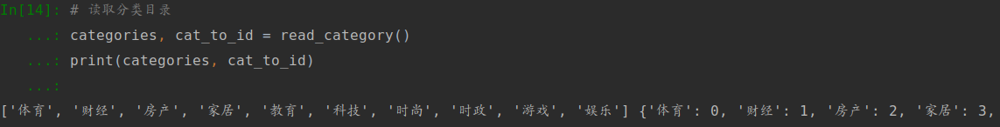

# task-01

这是datawhale组织的组队学习第八期的‘NLP理论基础与实践（进阶）’项目；

也不知道自己有没有选的太难，就感觉是自己都有接触过，但又没了解的太深，所以趁此机会了解一下；

而其他的，感觉都好像太简单了（也不知道是不是自我感觉良好）就没怎么看。


本文本记录的是Task1,内容为数据集探索；

具体分为‘0-任务准备’、‘1-数据集探索’（探索‘THUCNNews数据子集’、以及‘IMDB’数据集‘，最后还有一点关于指标内容的学习）

## 0-准备任务


### 0-1.tensorflow安装/

> 推荐Anaconda（针对自己操作系统和位数下载对应版本）；推荐用conda create创建对应的python环境（注：某些python版本可能不支持tensorflow）；通过pip install来安装tensorflow。
> 参考： 
>
> tensorflow安装教程 
> [http://www.tensorflownews.com/series/tensorflow-install-tutorial/](http://www.tensorflownews.com/series/tensorflow-install-tutorial/)


由于先前已配置tensorflow,故该步骤省略。

目前配置情况如下表：

|     项     |        版本        | 备注 |
| :--------: | :----------------: | :--: |
|    系统    | ubuntu 18.04.2 LTS |  --  |
|    显卡    |      GTX1060       |  --  |
|    CUDA    |        10.0        |  --  |
| tensorflow |       1.13.1       | ---  |


### 0-2.tensrflow基础

关注图、会话、tensor、变量、feed和fetch；
使用图(graphs)来表示计算任务、在被称之为会话(Session)的上下文(context)中执行图、使用tensor表示数据、通过变量(Variable)维护状态；
使用feed和fetch为任意的操作赋值或者从其中获取数据。


参考[1]：

1. 一般我们无需显示的指定计算资源，Tensorflow可以自动地进行识别；如果要指定GPU，可通过如`tf.device(“/gpu:1”)`等方式设置。
2. 调用函数as_default()生成默认会话。


​		在启动默认会话后，可以通过调用eval()函数，直接输出变量的内容。

3. 若需要在Jupyter或IPython等python交互式环境开发。Tensorflow为了满足用户的这一需求，提供了一种专门针对交互式环境开发的方法InteractiveSession();


​		创建sess对象后，可以直接输出运算结果。

4. 对数值、向量还是对矩阵的初始化，都是通过调用constant()函数实现的;

   `tf.constant()`

   函数constant有五个参数，分别为value，name，dtype，shape和verify_shape。

   其中value为必选参数，其它均为可选参数。Value为常量的具体值，可以是一个数字，一维向量或是多维矩阵。Name是常量的名字，用于区别其它常量。Shape是指常量的维度，我们可以自行定义常量的维度。

   verify_shape是验证shape是否正确，默认值为关闭状态(False)。也就是说当该参数true状态时，就会检测我们所写的参数shape是否与value的真实shape一致，若不一致就会报TypeError错误。如：上例中的实际shape为(2,0)，若我们将参数中的shape属性改为(2,1)，程序就会报如下错误：

   ```pytho
   TypeError: Expected Tensor’s shape: (2, 1), got (2,).
   ```

5. 常见的初始化：

   常量

* `tf.zeros`、`tf.ones`:略

* `tf.fill( dims, value,name=None)`[7]:创建一个充满标量值的张量；此操作会创建一个形状的张量`dims`并填充它`value`;

* `tf.linspace(start, stop, num, name=None)`[7]:生成间隔中的值;`num`从中开始生成一系列均匀间隔的值`start`。如果`num > 1`，序列中的值增加`stop - start / num - 1`，以便最后一个是精确的`stop

```python
tf.linspace(10.0, 12.0, 3, name="linspace") => [ 10.0  11.0  12.0]
```

* `tf.range`[7]:创建一系列数字，这些数字以最多但不包括的`start`增量开始并以其为增量。`delta`，`limit`除非明确提供，否则从输入推断得到的张量的dtype；像Python内置一样`range`，`start`默认为0

  

  随机值

* `tf.random_normal()`：略

* `tf.truncated_normal()`[7]：生成截断的正态分布

* `tf.random_uniform()`[7]：均匀分布

* `tf.random_shuffle()`[7]：随机地沿着第一维度改变张量

```python
[[1, 2],       [[5, 6],
[3, 4],  ==>   [1, 2],
 [5, 6]]        [3, 4]]
```


6. 变量进行初始化。变量在使用前一定要进行初始化，且变量的初始化必须在模型的其它操作运行之前完;初始化三种方式：全部变量、初始化变量的子集以及初始化单个变量。

   

   global_variables_initializer()方法是不管全局有多少个变量，全部进行初始化，是最简单也是最常用的一种方式；

   variables_initializer()是初始化变量的子集，相比于全部初始化化的方式更加节约内存；

   Variable()是初始化单个变量，函数的参数便是要初始化的变量内容。

7. tensorflow变量的保存与恢复

   *保存*

   通过tf.train.Saver()方法创建一个Saver管理器，来保存计算图模型中的所有变量；

   

​			存储文件save.ckpt是一个二进制文件，Saver存储器提供了向该二进制文件保存变量和恢复变量的	方法。保存变量的方法就是程序中的save()方法，保存的内容是从变量名到tensor值的映射关系。完成	该存储操作后，会在对应目录下生成如图下所示的文件：


​			Saver提供了一个内置的计数器自动为checkpoint文件编号。这就支持训练模型在任意步骤多次保	存。此外，还可以通过global_step参数自行对保存文件进行编号，例如：global_step=2，则保存变	量的文件夹为model.ckpt-2。

​		*恢复*

​		要用和保存变量相同的Saver对象来恢复变量；


​		变量的获取是通过restore()方法，该方法有两个参数，分别是session和获取变量文件的位置。我们还可以通过latest_checkpoint()方法，获取到该目录下最近一次保存的模型。

8. Fetch的含义是指可以在一个会话中同时运行多个op。如输出一些中间的op，取回多个tensor;


参考[2]:

提供的代码是python2的，`xrange`和`print`处需要调整。


参考[3]:

1. 使用tensorflwo须知：

- 使用图 (graph) 来表示计算任务.
- 在被称之为 `会话 (Session)` 的上下文 (context) 中执行图.
- 使用 tensor 表示数据.
- 通过 `变量 (Variable)` 维护状态.
- 使用 feed 和 fetch 可以为任意的操作(arbitrary operation) 赋值或者从其中获取数据.


2. 对于tensorflow的大体理解:

TensorFlow 是一个编程系统, 使用图来表示计算任务. 图中的节点被称之为 *op* (operation 的缩写). 一个 op 获得 0 个或多个 `Tensor`, 执行计算, 产生 0 个或多个 `Tensor`. 每个 Tensor 是一个类型化的多维数组. 例如, 你可以将一小组图像集表示为一个四维浮点数数组, 这四个维度分别是 `[batch, height, width, channels]`.

一个 TensorFlow 图*描述*了计算的过程. 为了进行计算, 图必须在 `会话` 里被启动. `会话` 将图的 op 分发到诸如 CPU 或 GPU 之类的 `设备` 上, 同时提供执行 op 的方法. 这些方法执行后, 将产生的 tensor 返回. 在 Python 语言中, 返回的 tensor 是[numpy](http://www.numpy.org/) `ndarray` 对象; 在 C 和 C++ 语言中, 返回的 tensor 是 `tensorflow::Tensor` 实例.


3. 构造图-->计算图

4. `Session` 对象在使用完后需要关闭以释放资源. 除了显式调用 close (`sess.close()`)外, 也可以使用 "with" 代码块 来自动完成关闭动作.

5. `tf.assign(    ref, value,validate_shape=None,use_locking=None,name=None)`:图所描绘的表达式的一部分, 正如 `add()` 操作一样. 所以在调用 `run()` 执行表达式之前, 它并不会真正执行赋值操作.

   通过为其指定`value`来更新`ref`;此操作输出一个Tensor，在分配值后保存新值'ref'。这样可以更容易地链接需要使用重置值的操作[7]。

6. Feed

   在计算图中引入了 tensor, 以常量或变量的形式存储. TensorFlow 还提供了 feed 机制, 该机制 可以临时替代图中的任意操作中的 tensor 可以对图中任何操作提交补丁, 直接插入一个 tensor.

   feed 使用一个 tensor 值临时替换一个操作的输出结果. 你可以提供 feed 数据作为 `run()` 调用的参数. feed 只在调用它的方法内有效, 方法结束, feed 就会消失. 最常见的用例是将某些特殊的操作指定为 "feed" 操作, 标记的方法是使用 tf.placeholder() 为这些操作创建占位符.

```python
input1 = tf.placeholder(tf.float32)
input2 = tf.placeholder(tf.float32)
output = tf.mul(input1, input2)

with tf.Session() as sess:
  print sess.run([output], feed_dict={input1:[7.], input2:[2.]})

# 输出:
# [array([ 14.], dtype=float32)]
```

补充：对Feed与Feach进一步理解[8]


Feed原意为：喂; 在Tensorflow里引为'喂'数据；一般与`tf.placeholder()`共用；

Feach：原意为"for each"? 所以有对多个输出的意思？


参考[4]： 

大致浏览了一下，自己的网络不太行，有的图片加载起来比较慢。

PS：莫烦PYTHON：https://morvanzhou.github.io/ 蛮多东西的(有框架(tensorflow、pytorch、theano)的基础教材、一些模型的教材等等)，但好像近些年来没怎么更新了，大概是工作忙吧?


参考[5]：

关于系统学习tensorflow的资源

TensorFlow-Examples：https://github.com/aymericdamien/TensorFlow-Examples

这个还是不错的，现在也还在看这个，同时也含有2.0版。

补充:

1. TensorFlow 如何入门，如何快速学习？https://www.zhihu.com/question/49909565

   其中`知乎用户`的回答感觉还是看了蛮有收获的；给了一个思路，从更高的角度的看待tensorflow的学习；更多去关注tensorflow本身内部，以及大厂出的东西，第三方框架的支持（这大概就是最好的案例了），还有对丹方的迁移，从一个炼丹炉到因另一个的尝试；

   PS：感觉这是进阶的时候应该关注的，现在还是老老实实，先多练着先

2. 最全Tensorflow2.0 入门教程持续更新：https://zhuanlan.zhihu.com/p/59507137

   关注一下2.0 ;感觉将来不久就算2.0的天下了


参考[6]:


​	应用场景：**法律、医疗诊断、医疗咨询、法律顾问、投融资**；以及**语音助手、物联网、智能硬件、智能家居等等，凡是用到人机交互的**

​	总结：好好学习，未来是光明的


> datawhale的参考：
> [1]TENSORFLOW从入门到精通之——TENSORFLOW基本操作 [http://www.tensorflownews.com/2018/03/28/tensorflow_base/](http://www.tensorflownews.com/2018/03/28/tensorflow_base/)
> [2]tensorflow简介 
> [http://wiki.jikexueyuan.com/project/tensorflow-zh/get_started/introduction.html](http://wiki.jikexueyuan.com/project/tensorflow-zh/get_started/introduction.html)
> [3]tensorflow基本使用 [http://wiki.jikexueyuan.com/project/tensorflowzh/get_started/basic_usage.html](http://wiki.jikexueyuan.com/project/tensorflow-zh/get_started/basic_usage.html)
> [4]莫凡tensorflow
>  [https://morvanzhou.github.io/tutorials/machine-learning/tensorflow/](https://morvanzhou.github.io/tutorials/machine-learning/tensorflow/)
> [5]史上最全的Tensorflow学习资源汇总
>  [https://zhuanlan.zhihu.com/p/35515805](https://zhuanlan.zhihu.com/p/35515805)
> [6]微软周明：自然语言处理的历史与未来
>  [http://zhigu.news.cn/2017-06/08/c_129628590.htm](http://zhigu.news.cn/2017-06/08/c_129628590.htm)
>
> 
>
> 自己查到的资料：
>
> [7]官方文档：https://tensorflow.google.cn/versions/r1.13/api_docs/python/tf
>
> [8]TensorFlow学习笔记-feed与fetch：https://blog.csdn.net/qq_37791134/article/details/81712772


##  1-数据集探索 

### 1-1.数据集

> 数据集：中、英文数据集各一份
> 中文数据集：THUCNews
> THUCNews数据子集：[https://pan.baidu.com/s/1hugrfRu](https://pan.baidu.com/s/1hugrfRu) 密码：qfud
> 英文数据集：IMDB数据集 [Sentiment Analysis](http://ai.stanford.edu/~amaas/data/sentiment/)
>
> 

PS：对于`IMDB数据集`务必将其移动到想要保存的地方再解压，因为数据集含有多个文件，解压后再移动比较慢---来自先前痛苦的文件移动等待的经验


### 1-2.IMDB数据集下载和探索

参考TensorFlow官方教程：
[影评文本分类  |  TensorFlow](https://tensorflow.google.cn/tutorials/keras/basic_text_classification)
[科赛 - Kesci.com](https://www.kesci.com/home/project/5b6c05409889570010ccce90)


##### 1-2-1 案例1：影评文本分类  |  TensorFlow

代码见：[Code](basic_text_classification.py)

最终结果如下图：

训练集与验证集上的损失：


训练集与验证集上的准确率：


初步判定：存在较为明显的过拟合。


复现中遇到的问题：

1. 默认numpy版本与本地不同

```bash
Traceback (most recent call last):
  File "/home/nicken/venv/lib/python3.6/site-packages/IPython/core/interactiveshell.py", line 3296, in run_code
    exec(code_obj, self.user_global_ns, self.user_ns)
  File "<ipython-input-2-50e084a413f9>", line 11, in <module>
    (train_data, train_labels), (test_data, test_labels) = imdb.load_data(num_words=10000)
  File "/home/nicken/venv/lib/python3.6/site-packages/tensorflow/python/keras/datasets/imdb.py", line 86, in load_data
    x_train, labels_train = f['x_train'], f['y_train']
  File "/home/nicken/venv/lib/python3.6/site-packages/numpy/lib/npyio.py", line 262, in __getitem__
    pickle_kwargs=self.pickle_kwargs)
  File "/home/nicken/venv/lib/python3.6/site-packages/numpy/lib/format.py", line 696, in read_array
    raise ValueError("Object arrays cannot be loaded when "
ValueError: Object arrays cannot be loaded when allow_pickle=False
```

现默认版本为1.16.3，本地版本为1.16.4；原文档信息：

```python
"""
allow_pickle : bool, optional
Allow loading pickled data. Default: False    
.. versionchanged:: 1.16.3        
Made default False in response to CVE-2019-6446.
"""
```

原解决思路：找到如何判别numpy的代码的，通过特定的修改，以减少对源代码的影响；

在查看源代码的过程中发现，仿佛在一路涉及到的函数中，一直都是`allow_pickle=False`，未判定过，暂且放弃。

最终解决思路：采用参考[2]的方法，修改`imdb.py` 的源代码。


参考：

[1]使用google colab运行RNN网络代码报告错误"ValueError: Object arrays cannot be loaded when allow_pickle=False"https://blog.csdn.net/scrence/article/details/89645854

[2]何大卫的博客https://www.cnblogs.com/heenhui2016/p/10905281.html


##### 案例2：科赛 - Kesci.com

代码见：[Code](text_classification_kesci_code.ipynb)


复现遇到的问题：

1. 进行model.fit()时，出现如下报错：

   ```bash
   Epoch 1/90
   Traceback (most recent call last):
     File "/home/nicken/venv/lib/python3.6/site-packages/IPython/core/interactiveshell.py", line 3296, in run_code
       exec(code_obj, self.user_global_ns, self.user_ns)
     File "<ipython-input-5-c84ee8fd52d3>", line 31, in <module>
       verbose=1)
     File "/home/nicken/venv/lib/python3.6/site-packages/tensorflow/python/keras/engine/training.py", line 880, in fit
       validation_steps=validation_steps)
     File "/home/nicken/venv/lib/python3.6/site-packages/tensorflow/python/keras/engine/training_arrays.py", line 325, in model_iteration
       callbacks._call_batch_hook(mode, 'begin', batch_index, batch_logs)
     File "/home/nicken/venv/lib/python3.6/site-packages/tensorflow/python/keras/callbacks.py", line 196, in _call_batch_hook
       batch_hook = getattr(callback, hook_name)
   AttributeError: 'Metrics' object has no attribute 'on_train_batch_begin'
   ```

   解决方法：

   由于先后使用了
   
   ```python
   from tensorflow import keras
   from keras.callbacks import Callback
   ```
   
   而在`Metrics()`中所需的继承的为`tensorflow`的`keras.callbacks.Callback`,
   
   将第二行注释掉即可，然后使用`Metrics(keras.callbacks.Callback)`
   
   即：
   
   ```python
   from tensorflow import keras
   # from keras.callbacks import Callback
   
   # 中间代码省略
   
   class Metrics(keras.callbacks.Callback):
       # 后续代码省略
   ```
   
   
   
2. 解决了上述问题1后，随后遇到一个为`None`的问题

```bash
14848/15000 [============================>.] - ETA: 0s - loss: 0.6923 - acc: 0.5395Traceback (most recent call last):
  File "/home/nicken/NLP_study/nlp_env/lib/python3.6/site-packages/IPython/core/interactiveshell.py", line 3326, in run_code
    exec(code_obj, self.user_global_ns, self.user_ns)
  File "<ipython-input-3-203d64d6eb42>", line 7, in <module>
    verbose=1)
  File "/home/nicken/NLP_study/nlp_env/lib/python3.6/site-packages/tensorflow/python/keras/engine/training.py", line 880, in fit
    validation_steps=validation_steps)
  File "/home/nicken/NLP_study/nlp_env/lib/python3.6/site-packages/tensorflow/python/keras/engine/training_arrays.py", line 370, in model_iteration
    callbacks.on_epoch_end(epoch, epoch_logs, mode=mode)
  File "/home/nicken/NLP_study/nlp_env/lib/python3.6/site-packages/tensorflow/python/keras/callbacks.py", line 251, in on_epoch_end
    callback.on_epoch_end(epoch, logs)
  File "<ipython-input-2-5877908e9f60>", line 92, in on_epoch_end
    val_predict = (np.asarray(self.model.predict(self.validation_data[0]))).round()
TypeError: 'NoneType' object is not subscriptable
```

暂未解决


### 1-3.THUCNews数据集下载和探索

参考博客中的数据集部分和预处理部分：
[CNN字符级中文文本分类-基于TensorFlow实现 - 一蓑烟雨 - CSDN博客](https://blog.csdn.net/u011439796/article/details/77692621)
参考代码：[text-classification-cnn-rnn/cnews_loader.py at mas...](https://github.com/gaussic/text-classification-cnn-rnn/blob/master/data/cnews_loader.py)


在数据集中:

训练集中，共有10类文本，每类文本共有5000行；

验证集中，共有10类文本，每类文本共有500行；

文本类型有：'体育', '财经', '房产', '家居', '教育', '科技', '时尚', '时政', '游戏', '娱乐'

代码见：[Code](cnews_data.py)


功能函数的实现效果如下：





`x_train[0]`中间有部分省略


### 1-4.学习召回率、准确率、ROC曲线、AUC、PR曲线这些基本概念


关于TP、FP、FN、TN的理解


T开头表示‘真’，F开头表示‘假’，指的实际结果；

P结尾表示‘积极的’(positive)，N结尾表示‘消极的’(negative)，指的预测结果。


* **准确率（Accuracy）**：所有的预测正确（正类负类）的占总的比重

$$
Accuracy= \frac{TP+TN}{TP+FP+FN+TN}
$$

* **精确率（Precision）**：正确预测为正的占全部预测为正的比例

$$
Precision =  \frac{TP}{TP+FP}
$$

* **召回率（Recall）**：正确预测为正的占全部实际为正的比例

$$
Recall =  \frac{TP}{TN+FN}
$$

* **F1值（H-mean值）**：同时考虑精确率和召回率，都一样重要

$$
\frac{2}{F1} = \frac{1}{Precision}+\frac{1}{Recall}
$$

变形后为：
$$
F1 = \frac{2PR}{P+R}=\frac{2TP}{2TP+FP+FN}
$$


*  ROC曲线：

  ROC曲线常用于二分类问题中的模型比较，主要表现为一种真正例率 (TPR) 和假正例率 (FPR) 的权衡；曲线越靠近左上角，意味着越多的正例优先于负例，模型的整体表现也就越好。

  是一条曲线，由FPR和TPR的点连成。横轴是FPR，纵轴是TPR  ；
  $$
  TPR=  \frac{TP}{TP+FN} \\
  FPR=  \frac{FP}{FP+TN}
  $$
  TPR：真正类率(True positive rate)，预测为正且实际为正的样本占所有正例样本的比例。

  FPR：伪正类率(False positive rate)，预测为正但实际为负的样本占所有负例样本的比例；


* AUC：ROC曲线围成的面积 ，**即AUC**

  可以解读为：从所有正例中随机选取一个样本A，再从所有负例中随机选取一个样本B，分类器将A判为正例的概率比将B判为正例的概率大的可能性。可以看到位于随机线上方的点(如图中的A点)被认为好于随机猜测。在这样的点上TPR总大于FPR，意为正例被判为正例的概率大于负例被判为正例的概率。
  
  


ROC的优点[1]：

1. 兼顾正例和负例的权衡。因为TPR聚焦于正例，FPR聚焦于与负例，使其成为一个比较均衡的评估方法。

2. ROC曲线选用的两个指标，$TPR=  \frac{TP}{TP+FN}$,$FPR=  \frac{FP}{FP+TN}$，都不依赖于具体的类别分布。

   注意TPR用到的TP和FN同属P列，FPR用到的FP和TN同属N列，所以即使P或N的整体数量发生了改变，也不会影响到另一列。也就是说，即使正例与负例的比例发生了很大变化，ROC曲线也不会产生大的变化，而像Precision使用的TP和FP就分属两列，则易受类别分布改变的影响。

ROC的缺点[1]：

1. 上文提到ROC曲线的优点是不会随着类别分布的改变而改变，但这在某种程度上也是其缺点。因为负例N增加了很多，而曲线却没变，这等于产生了大量FP。像信息检索中如果主要关心正例的预测准确性的话，这就不可接受了。
2. 在类别不平衡的背景下，负例的数目众多致使FPR的增长不明显，导致ROC曲线呈现一个过分乐观的效果估计。ROC曲线的横轴采用FPR，根据$\frac{FP}{N}=\frac{FP}{FP+TN}$，当负例N的数量远超正例P时，FP的大幅增长只能换来FPR的微小改变。结果是虽然大量负例被错判成正例，在ROC曲线上却无法直观地看出来。（当然也可以只分析ROC曲线左边一小段）
   举个例子，假设一个数据集有正例20，负例10000，开始时有20个负例被错判，$FPR = \frac{20}{20+9980} = 0.002$，接着又有20个负例错判，$FPR_{2} = \frac{40}{40+9960} =0.004$，在ROC曲线上这个变化是很细微的。而与此同时Precision则从原来的0.5下降到了0.33，在PR曲线上将会是一个大幅下降。


* PR曲线：是由精确率和召回率的点连成的线，横轴为Recall ,纵轴为Precision；

  在PR曲线中越右上凸越好，PR想要Precision 和Recall同时高。


使用场景

1. ROC曲线由于兼顾正例与负例，所以适用于评估分类器的整体性能，相比而言PR曲线完全聚焦于正例。
2. 如果有多份数据且存在**不同**的类别分布，比如信用卡欺诈问题中每个月正例和负例的比例可能都不相同，这时候如果只想单纯地比较分类器的性能且剔除类别分布改变的影响，则ROC曲线比较适合，因为类别分布改变可能使得PR曲线发生变化时好时坏，这种时候难以进行模型比较；反之，如果想测试不同类别分布下对分类器的性能的影响，则PR曲线比较适合。
3. 如果想要评估在**相同**的类别分布下正例的预测情况，则宜选PR曲线。
4. 类别不平衡问题中，ROC曲线通常会给出一个乐观的效果估计，所以大部分时候还是PR曲线更好。
5. 最后可以根据具体的应用，在曲线上找到最优的点，得到相对应的precision，recall，f1 score等指标，去调整模型的阈值，从而得到一个符合具体应用的模型。


> datawhale的参考：
>
> [1]参考1：[机器学习之类别不平衡问题 (2) —— ROC和PR曲线_慕课手记](https://www.imooc.com/article/48072)
>
> 
>
> 自己的参考：
>
> [2]准确率、精确率、召回率、F1值、ROC/AUC整理笔记:https://blog.csdn.net/u013063099/article/details/80964865
>
> [3] 准确率&&精确率&&召回率&&ROC:https://segmentfault.com/a/1190000014829322
>
> [4]机器学习模型评估混淆矩阵、ROC曲线和AUC以及PR曲线https://blog.csdn.net/qq_27575895/article/details/81476871
>
> [5] [机器学习之类别不平衡问题 (2) —— ROC和PR曲线](https://www.cnblogs.com/massquantity/p/8592091.html)---参考[1]出处，会清晰点；这之中包含了代码实现。


