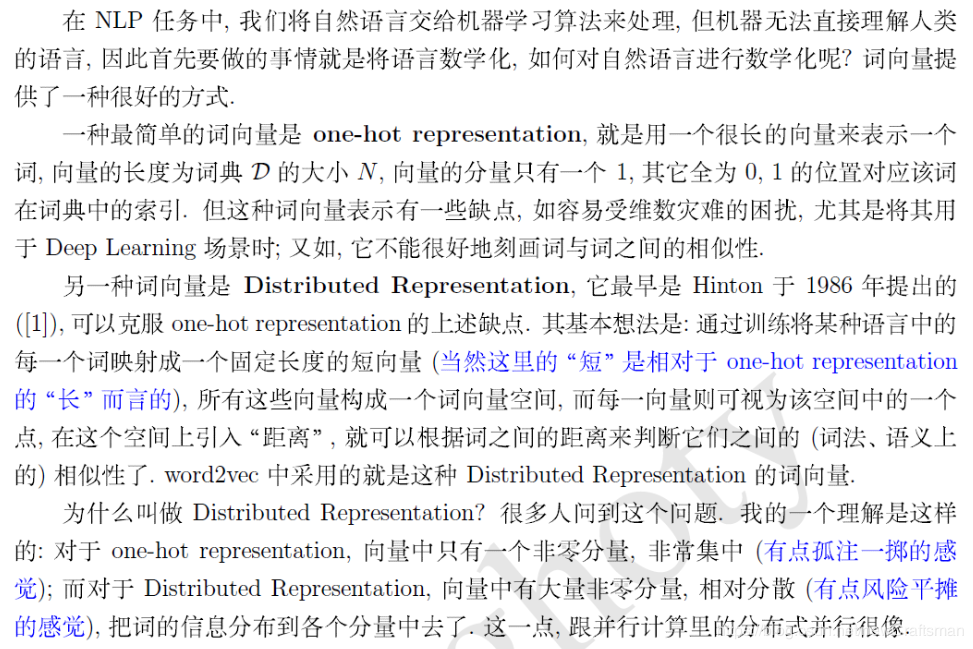
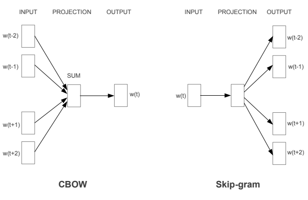

# task-02


## 1. 学习词袋模型概念：离散、高维、稀疏。

> 离散：在信息检索中，词袋模型假定对于一个文本，忽略其词序和语法、句法，将其仅仅看做是一个词合，		或者说是词的一个组合，文本中每个词的出现都是独立的，不依赖于其他词是否出现，或者说当这篇文章		的作者在任意一个位置选择一个词汇都不受前面句子的影响而独立选择的[9]。
>
> 高维：当文本数量多时，进而会导致词汇表增大，最后在表示时，维数也就增加了，因此高维；
>
> 稀疏：高维中，一次出现的字或词只是词汇表中较少的一部分，有由于词袋的形式，未出现的词对应的记为0，最终一文本在高维的表示中0占多数，进而导致稀疏。


### 1.1基本概念：

词袋（Bag of Words,BOW)

将文本拆分成词或字，建立字典，键值为该字或词的词频。

> 例句:
>
> Jane wants to go to Shenzhen.
>
> Bob  wants to go to Shanghai.
>
> 将所有词语装进一个袋子里，不考虑其词法和语序的问题，即每个词语都是独立的。例如上面2个例句，就可以构成一个词袋，袋子里包括Jane、wants、to、go、Shenzhen、Bob、Shanghai。假设建立一个数组（或词典）用于映射匹配
>
> ```
> 1 [Jane, wants, to, go, Shenzhen, Bob, Shanghai]
> ```
>
>  那么上面两个例句就可以用以下两个向量表示，对应的下标与映射数组的下标相匹配，其值为该词语出现的次数
>
> ```
> 1 [1,1,2,1,1,0,0]
> 2 [0,1,2,1,0,1,1]
> ```
>
> 这两个词频向量就是词袋模型，可以很明显的看到语序关系已经完全丢失。
>
> ---摘自参考[5]


### 1.2模型

#### 1.2. 1one-hot

> 看一个简单的例子。有两句话“邓紫棋太可爱了，我爱邓紫棋”，“我要看邓紫棋的演唱会”，把这两句话拆成一个个的字，整理得到14个不重复的字，这14个字决定了在文本表示时向量的长度为14。
>
> 下面这个表格的第一行是这两句话构成的一个词袋（或者说字典），有14个字。要对两句话进行数值表示，那么先构造一个2×14的零矩阵，然后找到第一句话中每个字在字典中出现的位置，把该位置的0替换为1，第二句话也这样处理。只管字出现了没有（出现了就填入1，不然就是0），而不管这个字在句子中出现了几次。
>
> 下面表格中的二、三行就是这两句话的one-hot表示。
>
> | 邓   | 紫   | 棋   | 太   | 可   | 爱   | 了   | 我   | 要   | 看   | 的   | 演   | 唱   | 会   |
> | ---- | ---- | ---- | ---- | ---- | ---- | ---- | ---- | ---- | ---- | ---- | ---- | ---- | ---- |
> | 1    | 1    | 1    | 1    | 1    | 1    | 1    | 1    | 0    | 0    | 0    | 0    | 0    | 0    |
> | 1    | 1    | 1    | 0    | 0    | 0    | 0    | 1    | 1    | 1    | 1    | 1    | 1    | 1    |
>
> 第一个问题是**数据稀疏和维度灾难**。数据稀疏也就是向量的大部分元素为0，如果词袋中的字词达数百万个，那么由每篇文档转换成的向量的维度是数百万维，由于每篇文档去重后字数较少，因此向量中大部分的元素是0。而且对数百万维的向量进行计算是一件比较蛋疼的事。
> 但是这样进行文本表示有几个问题。可见，尽管两个句子的长度不一样，但是one-hot编码后长度都一样了，方便进行矩阵运算。
>
> 第二个问题是**没有考虑句中字的顺序性**，假定字之间相互独立。这意味着意思不同的句子可能得到一样的向量。比如“我太可爱了，邓紫棋爱我”，“邓紫棋要看我的演唱会”，得到的one-hot编码和上面两句话的是一样的。
>
> 第三个问题是**没有考虑字的相对重要性**。这种表示只管字出现没有，而不管出现的频率，但显然一个字出现的次数越多，一般而言越重要（除了一些没有实际意义的停用词）。
>
> ----摘自参考[1]

这和自己原本理解中的one-hot不太一样，

原本理解的为，有14个字，那每一字的就算用维度为14的向量表示，一个句子为6个字，那就是一个14*6的矩阵；

不过按照这种理解的话，又考虑到句子的顺序，但使得矩阵更为稀疏了。


#### 1.2.2 TF-IDF

> TF-IDF用来评估字词对于文档集合中某一篇文档的重要程度。字词的重要性与它在某篇文档中出现的次数成正比，与它在所有文档中出现的次数成反比。TF-IDF的计算公式为：
> $$
> TF\times IDF=\frac{某文档中某字出现的次数}{该文档的总字数}  \times log\frac{全部文档的数量}{包含某字的文档的篇数 + 1}
> $$
>
> - $TF$(term frequency)，即词频，用来衡量字在一篇文档中的重要性；
>
> ​	为了防止数值过大，将其归一化，归一化:$出现次数 \times \frac{1}{总字数}$；
>
> - $IDF$((inverse document frequency)，叫做逆文档频率，衡量某个字在所有文档集合中的常见程度。当包含某个字的文档的篇数越多时，这个字也就烂大街了，重要性越低。
>
> 存在着数据稀疏的问题，也没有考虑字的前后信息。
>
> ----摘自参考[1],并进行部分添加

TF-IDF解决了字相对重要性的问题，将得到的每次字的TF-IDF的值代替原本从词频[2]。


#### 1.1.3 n-gram

> 上面词袋模型的两种表示方法假设字与字之间是相互独立的，没有考虑它们之间的顺序。于是引入n-gram（n元语法）的概念。n-gram是从一个句子中提取n个连续的字的集合，可以获取到字的前后信息。一般2-gram或者3-gram比较常见。
>
> 比如“邓紫棋太可爱了，我爱邓紫棋”，“我要看邓紫棋的演唱会”这两个句子，分解为2-gram词汇表：
>
> ｛邓，邓紫，紫，紫棋，棋，棋太，太，太可，可，可爱，爱，爱了，了，了我，我，我爱，爱邓，我要，要，要看，看邓，棋的，的，的演，演，演唱，唱会，会｝
>
> 于是原来只有14个字的1-gram字典（就是一个字一个字进行划分的方法）就成了28个元素的2-gram词汇表，词表的维度增加了一倍。
>
> 结合one-hot，对两个句子进行编码得到：
>
> [1, 1, 1, 1, 1, 1, 1, 1, 1, 1, 1, 1, 1, 1, 1, 1, 1, 0, 0, 0, 0, 0, 0, 0, 0, 0, 0,0]
>
> [1, 1, 1, 1, 1, 0, 0, 0, 0, 0, 0, 0, 0, 0, 1, 0, 0, 1, 1, 1, 1, 1, 1, 1, 1, 1, 1,1]
>
> 也可以结合TF-IDF来得到文本表示，这里不再计算。
>
> 这种表示方法的好处是可以获取更丰富的特征，提取字的前后信息，考虑了字之间的顺序性。
>
> 但是问题也是显而易见的，这种方法没有解决数据稀疏和词表维度过高的问题，而且随着n的增大，词表维度会变得更高。
>
> --- 摘自参考[1]


### 1.3 code：词频、归一化后的词频、TF-IDF

> 来自参考[6]

```python

# 导入模块
import collections
import pandas as pd
import numpy as np

from sklearn.pipeline import Pipeline
from sklearn.feature_extraction.text import CountVectorizer, TfidfVectorizer
from sklearn.linear_model import LogisticRegression
from sklearn.model_selection import train_test_split, cross_val_score, KFold

# 导入数据
doc = "In the-state-of-art of the NLP field, Embedding is the \
success way to resolve text related problem and outperform \
Bag of Words ( BoW ). Indeed, BoW introduced limitations \
large feature dimension, sparse representation etc."

# 词频
count_vec = CountVectorizer()
count_occurs = count_vec.fit_transform([doc]) # 导入文本
count_occur_df = pd.DataFrame((count, word) for word, count in zip(count_occurs.toarray().tolist()[0], 			 
                                                                   count_vec.get_feature_names()))# 分别提取出词频及对应的单词，并构建成字典，然后循环提取出来给到pd构建表格。
count_occur_df.columns = ['Word', 'Count']
count_occur_df.sort_values('Count', ascending=False, inplace=True)
count_occur_df.head()

# 归一化词频
norm_count_vec = TfidfVectorizer(use_idf=False, norm='l2') # 只需计算TF即可
norm_count_occurs = norm_count_vec.fit_transform([doc])
norm_count_occur_df = pd.DataFrame((count, word) for word, count in zip(
    norm_count_occurs.toarray().tolist()[0], norm_count_vec.get_feature_names()))
norm_count_occur_df.columns = ['Word', 'Count']
norm_count_occur_df.sort_values('Count', ascending=False, inplace=True)
norm_count_occur_df.head()

# TF-IDF
tfidf_vec = TfidfVectorizer()
tfidf_count_occurs = tfidf_vec.fit_transform([doc])
tfidf_count_occur_df = pd.DataFrame((count, word) for word, count in zip(
    tfidf_count_occurs.toarray().tolist()[0], tfidf_vec.get_feature_names()))
tfidf_count_occur_df.columns = ['Word', 'Count']
tfidf_count_occur_df.sort_values('Count', ascending=False, inplace=True)
tfidf_count_occur_df.head()
```


更多TF-IDF的代码见参考[7]


### 1.4 应用案例[3]：

近几年，在图像领域，使用Bag-of-words方法也是取得了较好的结果。

如果说文档对应一幅图像的话，那么文档内的词就是一个图像块的特征向量。一篇文档有若干个词构成，同样的，一幅图像由若干个图像块构成，而特征向量是图像块的一种表达方式。

我们求得N幅图像中的若干个图像块的特征向量，然后用k-means算法把它们聚成k类，这样我们的词袋里就有k个词，然后来了一幅图像，看它包含哪些词，包含单词A，就把单词A的频数加1。

最后归一化，得到这幅图像的BoW表示，假如k=4,每幅图像有8个小块(patch)，那么结果可能是这样的：[2,0,4,2]，归一化之后为[0.25,0,0.5,0.25]。


同样，在语音识别领域，也有Bag-of-words方法也大施了拳脚。

假设一段语音信号有2秒长，我们取每帧长40ms,帧移10ms,就可以得到一小段一小段的语音信号，然后提取每一小段上的音频特征，假设这里使用12维MFCC，那么有多少个小段语音信号，就有多少个MFCC特征向量。

我们的目标是来一段语音信号，判断它的情感类别。我们的做法是：取一定数量的MFCC特征向量，将它们聚成k个类，那么这里的词袋里的词就是这k个类别。对于一段语音信号，我们对其进行分段之后，将各小段分配到这k个类别上，那么，每个类别上就对应了这一段语音信号里属于该类的段的个数。最后归一化，得到其特征表示。


### 1.5 补充

  1. 文本表示分为离散表示和分布式表示。

     离散表示的代表就是词袋模型，one-hot（也叫独热编码）、TF-IDF、n-gram都可以看作是词袋模型。

     分布式表示也叫做词嵌入（word embedding），经典模型是word2vec，还包括后来的Glove、ELMO、GPT和最近很火的BERT[1]。

  2. 文本表示按照细粒度划分，一般可分为字级别、词语级别和句子级别的文本表示[1]

  3. 文本的离散表示存在着数据稀疏、向量维度过高、字词之间的关系无法度量的问题，适用于浅层的机器学习模型，不适用于深度学习模型[1]

  4. 当使用词袋模型时，存在减小词汇量的压力的时候[8]。

     那么这里有**有一些简单的文本清理技术**，例如：

     - 忽略案例
     - 忽略标点符号
     - 忽略不包含太多信息的常用词，称为停用词，如**“a”，“of”**等。
     - 修复拼写错误的单词。
     - 使用词干算法将单词减少到词干(e.g. “play” from “playing”) 。


参考：

> [1] [文本离散表示（一）：词袋模型（bag of words）](https://www.cnblogs.com/Luv-GEM/p/10543612.html)
>
> [2] [TF-IDF算法介绍及实现](https://blog.csdn.net/asialee_bird/article/details/81486700)
>
> [3] [Bag-of-words 词袋模型基本原理](https://blog.csdn.net/Jaster_wisdom/article/details/81539623)
> [4] [词袋模型（bag of words，BOW)](https://blog.csdn.net/weixin_43112462/article/details/88669902)
>
> [5] [词袋模型（BOW，bag of words）和词向量模型（Word Embedding）概念介绍](https://www.cnblogs.com/chenyusheng0803/p/10978883.html)
>
> [6] [【干货】NLP中“词袋”模型和词嵌入模型的比较（附代码）](https://yq.aliyun.com/users/o3u4mvu6rfxm2)
>
> [7] [TF-IDF算法介绍及实现](https://blog.csdn.net/asialee_bird/article/details/81486700)
>
> [8] [你知道词袋模型吗？](https://www.itcodemonkey.com/article/5799.html)
>
> [9] [[NLP学习笔记-Task4] 词袋模型 + 词向量 + word2vec](https://blog.csdn.net/newCraftsman/article/details/90294374)
>
> 


## 2. 学习分布式表示概念：连续、低维、稠密。





连续：原本是相互独立的，映射到同一个固定长度的向量后，可通过判断距离来判断相似性；

低维：在原本高维中，映射到一个固定且维度较低的词向量空间中；

稠密：相对于原本的高维中，只有一个非零量，而在分布式表示中，有较多非零量。


关于`分布表示`与`分布式表示`:

* 分布表示（distributional representation）：分布（distributional）描述的是上下文的概率分布，因此用上下文描述语义的表示方法（基于分布假说的方法）都可以称作分布表示。与之相对的是形式语义表示。

* 分布式表示（distributed representation）：分布式（distributed）描述的是把信息**分布式地存储在向量的各个维度中**，与之相对的是局部表示（localrepresentation），如词的独热表示（one-hot representation），在高维向量中 只有一个维度描述了词的语义。一般来说，通过矩阵降维或神经网络降维可以将语义分散存储到向量的各个维度中，因此，这类方法得到的低维向量一般都可以称作分布式表示。


参考

> [1] [NLP-分布表示(distributional representation)与分布式表示(distributed representation)](https://blog.csdn.net/spring_willow/article/details/81452162)
>
> [9] [[NLP学习笔记-Task4] 词袋模型 + 词向量 + word2vec](https://blog.csdn.net/newCraftsman/article/details/90294374)


## 3. 理解word2vec词向量原理并实践，来表示文本。


word2vec是用一个一层的神经网络(即CBOW)把one-hot形式的稀疏词向量映射称为一个n维(n一般为几百)的稠密向量的过程。

为了加快模型训练速度，其中的tricks包括Hierarchical softmax，negative sampling, Huffman Tree等[1]。


主要分为两个模型：

### 3.1 CBOW与Skip-Gram



* CBOW(Continuous Bag-of-Words Model):用上下文单词预测中心词
* Skip-Gram(Continuous Skip-gram Model):用中心词来预测上下文

> CBOW对小型数据库比较合适，而Skip-Gram在大型语料中表现更好[3]。 


### 3.2 训练过程（以CBOW为例）

> 
>
> 步骤：
> 1、Input layer输出层：是上下文单词的one hot。假设单词向量空间的维度为V，即整个词库corpus大小为V	，上下文单词窗口的大小为C。 
> 2、假设最终词向量的维度大小为N，则图中的权值共享矩阵为W。W的大小为 V * N，并且初始化。 
> 3、假设语料中有一句话”我爱你”。如果我们现在关注”爱”这个词，令C=2，则其上下为”我”,”你”。		模型把”我” “你”的onehot形式作为输入。易知其大小为1*V。C个1*V大小的向量分别跟同一个V * N大		小的权值共享矩阵W相乘，得到的是C个1*N大小的隐层hidden layer。 
> 4.C个1*N大小的hidden layer取平均，得到一个1*N大小的向量，即图中的Hidden layer。 
> 5.输出权重矩阵W’为N*V，并进行相应的初始化工作。 
> 6.将得到的Hidden layer向量 1*V与W’相乘，并且用softmax处理，得到1*V的向量，此向量的每> 一维代表		corpus中的一个单词。概率中最大的index所代表的单词为预测出的中间词。 
> 7.与groud truth中的one hot比较，求loss function的的极小值。
>
> ---摘自参考[1]
>
> 
>
> 输入层： 个节点个词的one-hot 编码表示
>
> 输入层到投影层到连接边：输入词矩阵 维；
>
> 投影层：  个节点，上下文共  个词的one-hot 表示和输入词矩阵相乘后得到的词向量求和再平均的值，也就是 的求和再平均 ；
>
> 投影层到输出层的连接边：输出词矩阵  维；
>
> 输出层： 个节点，先经过softmaii个节点代表ii的概率，后得到最大概率词的one-hot表示。
>
> ---摘自参考[5]


输入：需要预测的中心词的，上下C个词的one-hot的向量

> 在原文中，并不算固定窗口C，而是在固定一个量L，然后每次在0~L，之间随机取一个C[4]

中间：只有一层隐藏层，神经元个数为N，将得到的C个向量相加去平均给到后一层网络

> Hidden Layer没有激活函数[3]

输入：通过softmax得到在V个单词中，概率最大的那个词

最终目的：隐藏层的参数


代码参考：[code1](https://tensorflow.google.cn/tutorials/representation/word2vec#the_skip-gram_model)、[code2](https://github.com/rndbrtrnd/udacity-deep-learning)、[code3](https://github.com/AliceDudu/Learning-Notes/blob/master/Deep-Learning-for-NLP-CS224d/skipgram.ipynb)

代码还没来得及测试，后补充；


参考：

> [1] [小白都能理解的通俗易懂word2vec详解](https://blog.csdn.net/bitcarmanlee/article/details/82291968)
>
> [2] Tomas Mikolov, Kai Chen, Greg Corrado, Jeffrey Dean,  Efficient Estimation of Word Representations in Vector Space, 2013
>
> [3] [大白话讲解word2vec到底在做些什么](https://blog.csdn.net/mylove0414/article/details/61616617)
>
> [4] [[自然语言处理] (4) Word2Vec](https://blog.csdn.net/leyounger/article/details/78206832)
>
> [5] [全面理解word2vec](https://bigquant.com/community/t/topic/127068)


## 4. word2vec 中的数学原理详解  [word2vec](https://blog.csdn.net/itplus/article/details/37969519)[1](https://blog.csdn.net/itplus/article/details/37969519)

后补充；


参考：

> [1] [word2vec 中的数学原理详解](https://www.cnblogs.com/peghoty/p/3857839.html)


## 5.word2vec原理推导与代码分析 [ ](http://www.hankcs.com/nlp/word2vec.html)[word2vec2](http://www.hankcs.com/nlp/word2vec.html)

后补充；


