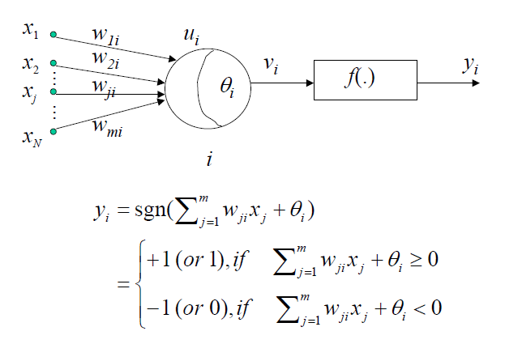
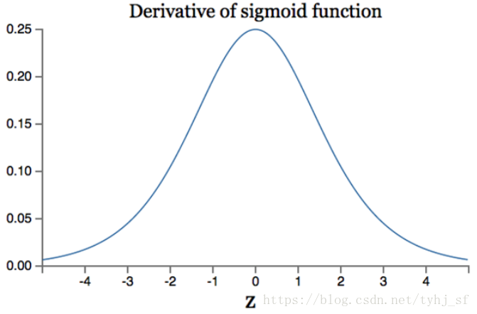
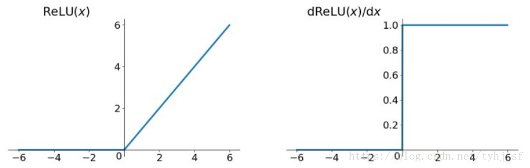

# task-03

## 1. 前馈神经网络、网络层数、输入层、隐藏层、输出层、隐藏单元、激活函数的概念。

* 前馈神经网络，又称为深度前馈网络，又称为多层感知机；该模型与一个有向无环图相关联，图的描述显示其如何复合在一起；


* 关于网络层数、输入层、隐藏层、输出层

  

输入层：前向传播的第一层，为数据的输入；

输出层：前向传播的最高一层，为输出结果；

隐藏层：位于输入层与输出层之间的网络；

网络层数=输入层+隐藏层数+输出层；（又有说法说，输入层不算，其没有作运算，所有这个应该是两层[5] [6]）

隐藏单元：一层隐藏层中含有的单元数（如上图中含有3个）

激活函数：神经网络中的每个神经元节点接受上一层神经元的输出值作为本神经元的输入值，并将输入值传递给下一层，输入层神经元节点会将输入属性值直接传递给下一层（隐层或输出层）。在多层神经网络中，上层节点的输出和下层节点的输入之间具有一个函数关系，这个函数称为激活函数（又称激励函数）[4]。


其中$z$为：
$$
z=\sum x_iw_i=x_1w_1+x_2w_2+x_3w_3+x_0w_0 \\
其中，x_0 = 1;w_0=b
$$


参考

> [1] lan Goodfellow, 深度学习，2017
>
> [2] [前馈神经网络开山鼻祖---一些概念](https://segmentfault.com/a/1190000013504333)
>
> [3] [神经网络的理解与实现](https://www.cnblogs.com/lliuye/p/9183914.html)
>
> [4] [常用激活函数（激励函数）理解与总结](https://blog.csdn.net/tyhj_sf/article/details/79932893)
>
> [5] [深度学习入门系列：感知机-多层感知机演变](https://www.jianshu.com/p/8231b0a87f2e)
>
> [6] [动手学深度学习#3.8.3. 多层感知机](https://zh.gluon.ai/chapter_deep-learning-basics/mlp.html)


## 2. 感知机相关；定义简单的几层网络（激活函数sigmoid），递归使用链式法则来实现反向传播。

感知机（perceptron）由两层神经元组成，如下图所示，输入层接受外界输入信号后传递给输出层，输出层是M-P神经元，亦称作“阈值逻辑单元”（threshold logic unit）



多层感知机：在单层神经网络（如线性回归和softmax回归）的基础上引入了一到多个隐藏层（hidden layer）;

每个隐藏层有多个感知机组成，但将原本的阀值判断换为激活函数，均采用$ sigmoid $,

> 解决异或问题


实现：参考自[3]，并做了部分调整，增加代码可阅读性，调整激活函数均为sigmoid，增加隐藏层；[Code](mlp_tensorflow.py)


参考

> [1] [多层感知机及其BP算法（Multi-Layer Perception）](https://www.cnblogs.com/ooon/p/5577241.html)
>
> [2]  [（数据科学学习手札34）多层感知机原理详解&Python与R实现](https://www.cnblogs.com/feffery/p/8996623.html)
>
> [3] [（数据科学学习手札36）tensorflow实现MLP](https://www.cnblogs.com/feffery/p/9030446.html)


## 3. 激活函数的种类以及各自的提出背景、优缺点。（和线性模型对比，线性模型的局限性，去线性化）

#### 3.1 sigmoid函数

> Sigmoid 是常用的非线性的激活函数，它的数学形式如下：
> $$
> f(z)=\frac{1}{1+e^{-z}}
> $$
> Sigmoid的几何图像如下：
>
> 
>
> * 特点：
>   它能够把输入的连续实值变换为0和1之间的输出，特别的，如果是非常大的负数，那么输出就是0；如果是非常大的正数，输出就是1.
>
> * 缺点：
>   sigmoid函数曾经被使用的很多，不过近年来，用它的人越来越少了。主要是因为它固有的一些 缺点。
>
>   * 缺点1：在深度神经网络中梯度反向传递时导致梯度爆炸和梯度消失，其中梯度爆炸发生的概率非常小，而梯度消失发生的概率比较大。首先来看Sigmoid函数的导数，如下图所示：
>
>   
>
>   如果我们初始化神经网络的权值为$ [0,1]$之间的随机值，
>
>   由反向传播算法的数学推导可知，梯度从后向前传播时，每传递一层梯度值都会减小为原来的0.25倍，如果神经网络隐层特别多，那么梯度在穿过多层后将变得非常小接近于0，即出现梯度消失现象；
>
>   当网络权值初始化为$ (1,+\infty) $区间内的值，则会出现梯度爆炸情况。
>   详细数学分析见文章：http://neuralnetworksanddeeplearning.com/chap5.html 中文译文：深度神经网络为何很难训练
>
>   * 缺点2：Sigmoid 的 output 不是0均值（即zero-centered）。这是不可取的，因为这会导致后一层的神经元将得到上一层输出的非0均值的信号作为输入。 
>
>     产生的一个结果就是：如$x>0, f=w^{T} x+b$,那么对w求局部梯度则都为正，这样在反向传播的过程中w要么都往正方向更新，要么都往负方向更新，导致有一种捆绑的效果，使得收敛缓慢。
>
>      当然了，如果按batch去训练，那么那个batch可能得到不同的信号，所以这个问题还是可以缓解一下的。因此，非0均值这个问题虽然会产生一些不好的影响，不过跟上面提到的梯度消失问题相比还是要好很多的。
>
>     补充：**sigmoid函数可用在网络最后一层，作为输出层进行二分类**，尽量不要使用在隐藏层[2]
>
>   * 缺点3：其解析式中含有幂运算，计算机求解时相对来讲比较耗时。对于规模比较大的深度网络，这会较大地增加训练时间。
>
> --- 基于参考[1]


#### 3.2 tanh函数

> tanh函数解析式：
> $$
> \tanh (x)=\frac{e^{x}-e^{-x}}{e^{x}+e^{-x}}
> $$
> 
>
> ​	
>
> tanh函数及其导数的几何图像如下图：
>
> 
>
> tanh读作Hyperbolic Tangent，
>
> * 优点：
>
>   它解决了Sigmoid函数的不是zero-centered输出问题，
>
> * 缺点：
>
>   梯度消失（gradient vanishing）的问题和幂运算的问题仍然存在。
>
> ---基于参卡[1]


#### 3.3 ReLu函数

> ReLU函数又称为**修正线性单元（Rectified Linear Unit）**，是一种分段线性函数，其弥补了sigmoid函数以及tanh函数的**梯度消失问题**；Relu函数的解析式：
> $$
> ReLu=max(0,x)
> $$
> Relu函数及其导数的图像如下图所示：
>
> 
>
> ReLU函数其实就是一个取最大值函数，注意这并不是全区间可导的，但是我们可以取sub-gradient，如上图所示。ReLU虽然简单，但却是近几年的重要成果；
>
> * 优点：
>   1） 解决了gradient vanishing（梯度消失）问题 (输入为正数的时候)
>   2）计算速度非常快，只需要判断输入是否大于0
>   3）收敛速度远快于sigmoid和tanh
>
> * ReLU也有几个需要特别注意的问题：
>   1）ReLU的输出不是zero-centered（零均值)
>
>   2）Dead ReLU Problem，指的是某些神经元可能永远不会被激活，导致相应的参数永远不能被更新。有两个主要原因可能导致这种情况产生:
>
>   （1）非常不幸的参数初始化，这种情况比较少见 
>
>   （2） learning rate太高导致在训练过程中参数更新太大，不幸使网络进入这种状态。
>
>   解决方法是可以采用Xavier初始化方法，以及避免将learning rate设置太大或使用adagrad等自动调节learning rate的算法。
>
> --- 基于参考[1]修改


#### 3.4 Leaky ReLU函数


> 这是一种对ReLU函数改进的函数，又称为PReLU函数，函数表达式：
> $$
> f(x)=max(αx,x)
> $$
> Leaky Relu函数及其导数的图像如下图所示：
>
> 
>
> 人们为了解决Dead ReLU Problem，提出了将ReLU的前半段设为$ \alpha x$而非0，通常$\alpha=0.01$（左上图极为如此）。另外一种直观的想法是基于参数的方法，即$ParametricReLU:f(x)=max(\alpha x,x) $，其中$\alpha$可由反向传播算法获得。
>
> 理论上来讲，Leaky ReLU有ReLU的所有优点，外加不会有Dead ReLU问题，但是在实际操作当中，并没有完全证明Leaky ReLU总是好于ReLU。
>
> ---基于参考[1]修改部分

#### 3.5 ELU函数

> 函数表达式：
> $$
> f(x)=\left\{\begin{array}{ll}{x,} & {\text { if } x>0} \\ {\alpha\left(e^{x}-1\right),} & {\text { otherwise }}\end{array}\right.
> $$
> ​	
>
> 函数及其导数的图像如下图所示：
>
> 
>
>
> ELU也是为解决ReLU存在的问题而提出，显然，ELU有ReLU的基本所有优点，以及：
>
> * 不会有Dead ReLU问题
> * 输出的均值接近0，zero-centered
>
> 缺点：
>
> * 它的一个小问题在于计算量稍大。类似于Leaky ReLU，理论上虽然好于ReLU，但在实际使用中目前并没有好的证据ELU总是优于ReLU。

3.6 MaxOut函数

> 这个函数可以参考论文《maxout networks》，Maxout是深度学习网络中的一层网络，就像池化层、卷积层一样等，我们可以把maxout 看成是网络的激活函数层，我们假设网络某一层的输入特征向量为：X=（x1,x2,……xd），也就是我们输入是d个神经元。
>
> Maxout隐藏层每个神经元的计算公式如下：
> $$
> h_{i}(x)=\max _{j \in[1, k]} z_{i j}
> $$
> 上面的公式就是maxout隐藏层神经元i的计算公式。其中，k就是maxout层所需要的参数了，由我们人为设定大小。就像dropout一样，也有自己的参数p(每个神经元dropout概率)，maxout的参数是k。
>
> 公式中Z的计算公式为：
> $$
> z_{i j}=x^{T} W \ldots i j+b_{i j}
> $$
> 
>
> 权重w是一个大小为(d,m,k)三维矩阵，b是一个大小为(m,k)的二维矩阵，这两个就是我们需要学习的参数。如果我们设定参数k=1，那么这个时候，网络就类似于以前我们所学普通的MLP网络。
>
> 我们可以这么理解，本来传统的MLP算法在第i层到第i+1层，参数只有一组，然而现在我们不这么干了，我们在这一层同时训练n组的w、b参数，然后选择激活值Z最大的作为下一层神经元的激活值，这个max（z）函数即充当了激活函数。

3.6 与线性

>  我们以这样一个例子进行理解。
>   假设下图中的隐藏层使用的为**线性激活函数（恒等激活函数）**，也就是说 g(z)=zg(z)=z 。
>
>
> 
>
>   于是我们可以得出：
> $$
> \begin{array}{c}{z^{[1]}=W^{[1]} x+b^{[1]}} \\
> {a^{[1]}=g\left(z^{[1]}\right)=z^{[1]}} \\
> {z^{[2]} a^{[1]}+b^{[2]}\left(W^{[1]} x+b^{[1]}\right)+b^{[2]}} \\ {a^{[2]}=g\left(z^{[2]}\right)=g^{[2]}\left(W^{[1]} x+b^{[2]}=W^{[1]} W^{[2]} x+W^{[2]} b^{[1]}+b^{[2]}\right.} \\ 
> {\hat{y}=a^{[1]} W^{[2]} x+W^{[2]} b^{[1]}+b^{[2]}}\end{array}
> $$
> 
>
> 可以看出，当激活函数为**线性激活函数**时，输出 $\hat{y} $不过是输入特征$ x$的**线性组合**（无论多少层），而不使用神经网络也可以构建这样的线性组合。
>
> 而当激活函数为**非线性激活函数**时，通过神经网络的不断加深，可以构建出各种有趣的函数。
>
> ---参考[2]

使用线性函数，构建出来的还只是线性函数；

使用非线性函数，可实现对复杂函数的逼近。


#### 3.7 其他激活函数


参考:

> [1] [常用激活函数（激励函数）理解与总结](https://blog.csdn.net/tyhj_sf/article/details/79932893)
>
> [2] [神经网络中常用的几种激活函数的理解](https://www.cnblogs.com/lliuye/p/9486500.html)
>
> [3] [AI数学基础11——为什么人工神经网络需要非线性激活函数？](https://www.jianshu.com/p/c1d2a16b9f62)
>
> [4] [激活函数](https://www.jiqizhixin.com/graph/technologies/1697e627-30e7-48a6-b799-39e2338ffab5)


## 4. 深度学习中的正则化（参数范数惩罚：L1正则化、L2正则化；数据集增强；噪声添加；early stop；**Dropout层**）、正则化的介绍。

正则化(Regularization):一类通过限制模型复杂度，从而避免过拟合，提高泛化能力的方法，包括引入一些约束规则、增加先验、提前停止等[1]。


#### 4.1 参数范数惩罚：L1正则化、L2正则化

> 在传统的机器学习中，提高泛化能力主要通过限制模型的复杂度，如采取L1、L2正则等方式；
>
> 但在训练神经网络时，特别是在过渡参数时，L1、L2正则化的效果不如在浅层机器学习模型中显著。---参考[2]

通过加入 $\ell_1$ 和$\ell_2$ 正则化,优化问题可以写为
$$
\theta^{*}=\underset{\theta}{\arg \min } \frac{1}{N} \sum_{n=1}^{N} \mathcal{L}\left(y^{(n)}, f\left(\mathbf{x}^{(n)}, \theta\right)\right)+\lambda \ell_{p}(\theta)
$$
​		其中$L(·)$ 为损失函数,$N$ 为训练样本数量,$f (·) $为待学习的神经网络,$θ $为其参数,$\ell_p$ 为范数函数,$p$ 的取值通常为 {1, 2} 代表 $\ell_1$ 和$\ell_2$ 范数,$λ$ 为正则化系数。---参考[1]


关于 $\ell_1$ 和$\ell_2$ 正则化

> - 相比$\ell_2$ 正则化，$\ell_1$正则化会产生更稀疏的解。如果考虑Hessian矩阵是对角正定矩阵，我们得到$\ell_2$正则化的最优解是$\tilde{\omega_i}=\frac{H_{i,i}}{H_{i,i}+\alpha}\omega_i^{* }$。如果$\omega_i^{* }\neq 0$，则 $\tilde{\omega_i}\neq 0$，这说明$\ell_2$正则化不会使参数变得稀疏，而$\ell_1$正则化有可能通过足够大的$α$实现稀疏。
>
> - 正则化策略可以被解释为最大后验（MAP）贝叶斯推断。
>
>   - $\ell_2$ 正则化相当于权重是`高斯先验`的MAP贝叶斯推断。
>
>   - $\ell_1$ 正则化相当于权重是`Laplace先验`的MAP贝叶斯推断。
>
>     最大后验估计选择后验概率最大的点：
>    $$
>     \Theta_{MAP}=\mathop{\arg\max}_{\theta}p(\theta|x)=\mathop{\arg\max}_{\theta}\log p(x|\theta)+\log p(\theta)
>    $$
>     右边的$\log p(x\|\theta)$对应标准的对数似然项，$\log p(\theta)$对应先验分布。在神经网络中上述公式中的$θ$即我们考虑的权重$ω$。
>
>     - 如果先验是高斯分布$\mathcal{N}(\omega;0,\frac{1}{\alpha}I^2)$，即$p(\omega)\propto exp(-\frac{\alpha}{2}\omega^T\omega)$，从而有$\log p(\omega)\propto \alpha\omega^T\omega$。因此$\ell_2$正则化权重衰减对应着权重是高斯先验的MAP贝叶斯推断。
>     - 如果先验是Laplace分布$Laplace(\omega;0,\frac{1}{\alpha})$，即$p(\omega)=\frac{\alpha}{2}\exp(-\alpha\|x\|)$，对数先验项$\log p(\omega)=\sum_i\log Laplace(\omega_i;0,\frac{1}{\alpha})=-\alpha\|\omega\|_1+n\log \alpha-n\log 2$与$\ell_1$正则化代价函数惩罚项$\alpha\Omega(\omega)=\alpha \sum_i \|\omega_i\|$等价。
>
> ---参考[2]


> 在《深度学习》一书中，参数范数惩罚 L2 正则化能让深度学习算法「感知」到具有较高方差的输入 x，因此与输出目标的协方差较小（相对增加方差）的特征权重将会收缩。而 L1 正则化会因为在方向 i 上 $J(w; X, y) $对 $\hat{J}(w; X, y)$ 的贡献被抵消而使$w_i$ 的值变为 0（$\hat{J}(w; X, y)$ 为 $J(w; X, y)$加上 $ell_1$ 正则项）。此外，参数的范数正则化也可以作为约束条件。对于 L2 范数来说，权重会被约束在一个 L2 范数的球体中，而对于 L1 范数，权重将被限制在 L1 所确定的范围内
>
> ---参考[3]


#### 4.2 数据增强


> 让机器学习模型泛化得更好的最好办法是使用更多的数据进行训练，因此需要在有限的数据中创建假数据并添加到训练集中。数据集增强在对象识别领域是特别有效的方法。
>
> - 数据集的各种变换，如对图像的平移、旋转和缩放。
> - 在输入层注入噪声，也可以看作数据集增强的一种方法（如去噪自编码器）。通过将随机噪声添加到输入再进行训练能够大大改善神经网络的健壮性。
>
> ---参考[2]


> 目前,数据增强还主要应用在图像数据上,在文本等其它类型的数据还没有太好的方法。
>
> 图像数据的增强主要是通过算法对图像进行转变,引入噪声等方法来增加数据的多样性。增强的方法主要有几种:
>
> * 旋转(Rotation):将图像按顺时针或逆时针方向随机旋转一定角度;
> *  翻转(Flip):将图像沿水平或垂直方法随机翻转一定角度;
> * 缩放(Zoom In/Out):将图像放大或缩小一定比例;
> * 平移(Shift):将图像沿水平或垂直方法平移一定步长;
> * 加噪声(Noise):加入随机噪声。
>
> ---参考[1]

数据增强主要还是应用在图像比较多，其他领域的还比较少；


#### 4.3 标签平滑

在对样本特征加入随机噪声以避免过拟合的时候，也可以对标签引入一些噪声；

>  假设训练数据集中,有一些样本的标签是被错误标注的,那么最小化这些样本上的损失函数会导致过拟合。一种改善的正则化方法是标签平滑(Label Smoothing),即在输出标签中添加噪声来避免模型过拟合 [Szegedy et al., 2016]---参考[1]


> 一个样本 $\mathbf{x}$ 的标签一般用 onehot 向量表示
> $$
> \mathbf{y}=[0, \cdots, 0,1,0, \cdots, 0]^{\mathrm{T}}
> $$
> 这种标签可以看作是硬目标(Hard Targets);引入一个噪声对标签进行平滑,即假设样本以 $ε$ 的概率为其它类。平滑后的标签为
> $$
> \tilde{\mathbf{y}}=\left[\frac{\epsilon}{K-1}, \cdots, \frac{\epsilon}{K-1}, 1-\epsilon, \frac{\epsilon}{K-1}, \cdots, \frac{\epsilon}{K-1}\right]^{\mathrm{T}}
> $$
> 其中$K$ 为标签数量;
>
> 标签平滑可以避免模型的输出过拟合到硬目标上,并且通常不会损害其分类能力。
>
> ---节选自参考[1]


#### 4.4 early stop

> 由于神经网络强大的表示能力，当训练次数过多时会经常遭遇过拟合，即训练误差会随时间推移减少，而验证集误差会再次上升。
>
> - 如果我们只要返回使验证集误差最低的参数，就可以获得验证集误差更低的模型。这种策略被称为提前终止（early stopping）。由于它的有效性和简单性，这可能是深度学习中最常用的正则化形式。
> - 提前终止是一种非常不显眼的正则化形式，几乎不需要改变基本训练过程、目标函数。而使用权重衰减则必须小心不能使用太多的权重衰减，否则容易陷入局部极小点。
>
> 
>
> early stop算法：
>
> ------
>
> **输入**：nn为评估间隔步数，pp为patience（即观察到pp次更差的验证集表现后终止），θ0θ0为初始参数
>
> **过程**：
>
> 1： 初始化θ=θ0θ=θ0，i=0i=0，j=0j=0，v=∞v=∞，θ∗=θθ∗=θ，i∗=ii∗=i
>
> 2： while(j<p)while(j<p) dodo
>
> 3：  运行训练算法nn步，更新θθ。
>
> 4：  i=i+ni=i+n，v′=ValidationSetError(θ)v′=ValidationSetError(θ)
>
> 5：  if(v′<v)if(v′<v) thenthen
>
> 6：    j=0j=0，θ∗=θθ∗=θ，i∗=ii∗=i，v=v′v=v′
>
> 7：  elseelse
>
> 8：    j=j+1j=j+1
>
> 9：  endend ifif
>
> 10：endend whilewhile
>
> **输出**：最佳参数$\theta^* ，最佳训练步数，最佳训练步数i^* $
>
> ---
>
> 
>
> 优点：
>
> - 由于限制了训练迭代次数，减少了训练时的计算成本
> - 具有正则化效果而不需要添加惩罚项或计算其梯度。
>
> 
>
>  提前终止相当于$L_2$正则化
>
> ---参考[2]


#### 4.5 Dropout层

> Dropout基本原理
>
> - Dropout训练的集成包括所有从基础网络中除去神经元（非输出单元）后形成的子网络。只需将一些单元的输出乘零就能有效的删除一个单元（称之为乘零的简单Dropout算法）。假如基本网络有nn个非输出神经元，则一共有2n2n个子网络。
> - Dropout的目标是在指数级数量的神经网络上近似Bagging过程。具体来说，在训练中使用Dropout时，我们会使用基于小批量产生较小步长的学习算法，如随机梯度下降。
>   - 每次在小批量中加载一个样本，然后随机抽样（用于网络中所有输入和隐藏单元的）不同二值掩码。
>   - 对于每个单元，掩码是独立采样的。通常输入单元被包括的概率为0.80.8，隐藏单元被包括的概率为0.50.5。
>   - 然后与之前一样，运行前向传播、反向传播和学习更新。
>
> ---参考[2]

随机丢弃部分神经元，以避免过拟合，Dropout前后对比如图：


tensorflow命令：

```python
tf.nn.dropout(x, keep_prob, noise_shape=None, seed=None, name=None)
```

- 函数作用就是使得矩阵x的一部分（概率大约为keep_prob）变为0，其余变为element/keep_prob,
- noise_shape可以使得矩阵x一部分行全为0或者部分列全为0
- 用在tensorflow中使得部分神经元随机为0不参与训练，如果算法过拟合了，可以试试这个办法。


#### 4.6 权重衰减

> 权重衰减(Weight Decay)也是一种有效的正则化手段 [Hanson and Pratt,1989],在每次参数更新时,引入一个衰减系数。
> $$
> \theta_{t} \leftarrow(1-w) \theta_{t-1}-\alpha \mathbf{g}_{t}
> $$
> 其中$ g_t$ 为第 $t$ 更新的梯度,$α$ 为学习率,$w $为权重衰减系数,一般取值比较小,比如 0.0005。在标准的随机梯度下降中,权重衰减正则化和 $\ell_2$正则化的效果相同。因此,权重衰减在一些深度学习框架中通过 $\ell_2$ 正则化来实现。但是,在较为复杂的优化方法(比如 Adam)中,权重衰减和 $\ell_2$正则化并不等价 [Loshchilov and Hutter, 2017]
>
> ---参考[1]

权重衰减和 $\ell_2$正则化并不一定等价。


#### 4.7 稀疏表示

> 稀疏表示也是卷积神经网络经常用到的正则化方法。$L_1$正则化会诱导稀疏的参数，使得许多参数为00；而稀疏表示是惩罚神经网络的激活单元，稀疏化激活单元。换言之，稀疏表示是使得每个神经元的输入单元变得稀疏，很多输入是0。
>
> 例如下图，$h3$只依赖于上一层的3个神经元输入$x2、x3、x4$，而其他神经元到$h3$的输入都是0。
>
> 
>
> 


参考

> [1] [邱锡鹏](https://xpqiu.github.io/)， 《深度学习与神经网络》，2019
>
> [2] [深度学习中的正则化技术详解](https://www.cnblogs.com/lucius/p/9391286.html)
>
> [3] [一文概览深度学习中的五大正则化方法和七大优化策略](https://www.jiqizhixin.com/articles/2017-12-20)
>
> [4] [小结深度学习中的正则化（超详细分析）](https://blog.csdn.net/qq_16137569/article/details/81584165)
>
> [5] [tensorflow dropout用法](https://cloud.tencent.com/developer/article/1144919)


## 5. 深度模型中的优化：参数初始化策略；自适应学习率算法（梯度下降、AdaGrad、RMSProp、Adam；优化算法的选择）；**batch norm层**（提出背景、解决什么问题、层在训练和测试阶段的计算公式）；layer norm层。


#### 5.1 参数初始化策略；

> 注意事项：
>
> * 不可初始化全为0
> * 要破坏权重矩阵的对称结构


##### 5.1.1 初始化为`小的随机数`

> 如均值为0,方差为0.01的高斯分布:
> `W=0.01 * np.random.randn(D,H)` 然而只适用于小型网络,对于深层次网络,权重小导致反向传播计算中梯度也小,梯度"信号"被削弱.
>
> 由于高斯分布的方差随着输入数量的增大而增大,可以通过正则化方差来提高权重收敛速率,初始权重的方式为正态分布: `w = np.random.randn(n) / sqrt(n)`. 这会使得中间结果$z=\sum_i w_ix_i+b$的方差较小,神经元不会饱和,学习速度不会减慢.
>
> > 论文 [Delving Deep into Rectifiers: Surpassing Human-Level Performance on ImageNet Classification](http://arxiv-web3.library.cornell.edu/abs/1502.01852) by He et al. 中阐述了ReLU神经元的权值初始化方式,方差为2.0/n, 高斯分布权重初始化为: `w = np.random.randn(n) * sqrt(2.0/n)`, 这是使用ReLU的网络所推荐的一种方式.
> > 论文[Bengio and Glorot 2010]: [Understanding the difficulty of training deep feedforward neuralnetworks](http://jmlr.org/proceedings/papers/v9/glorot10a/glorot10a.pdf) 中推荐使用 $\text{Var}(W) = \frac{2}{n_\text{in} + n_\text{out}}$.
>
> ---参考[1]


##### 5.1.2 Xavier (均匀分布)

> Xavier初始化可以帮助减少梯度弥散问题， 使得信号在神经网络中可以传递得更深。是最为常用的神经网络权重初始化方法。
>
> 假设：激活函数关于0对称，且主要针对于全连接神经网络。适用于tanh和softsign。
> 使用条件：条件：正向传播时，激活值的方差保持不变；反向传播时，关于状态值的梯度的方差保持不变。
>
> 算法根据输入和输出神经元的数量自动决定初始化的范围: 定义参数所在的层的输入维度为n,输出维度为m,那么参数将从$[-{\sqrt{6\over m+n}},{\sqrt{6\over m+n}}]$均匀分布中采样。
>
> ---参考[2]
>
> 推导见参考[1]


##### 5.1.3 MSRA

> 初始时这一半的梯度为0，而tanh和sigmoid等的输出初始时梯度接近于1.因此使用ReLU的网络的参数方差可能会波动。论文[Delving Deep into Rectifiers: Surpassing Human-Level Performance on ImageNet Classification,Kaiming He](https://arxiv.org/abs/1502.01852)中提出使用$\text{Var}(W) = \frac{2}{n_\text{in}}$放大一倍方差来保持方差的平稳。
>
> 前向和后向推导的方差均控制在${2\over n}$,综合起来使用均值为0,方差为$\sqrt{4\over n_{in}+n_{out}}$的高斯分布.
>
> ---参考[1]


##### 5.1.4 偏置初始化

通常初始化为为0，若初始化为0.01等值,可能并不能得到好的提升,反而可能下降[1]


#### 5.2 自适应学习率算法（梯度下降、AdaGrad、RMSProp、Adam；优化算法的选择）；


##### 5.2.1 SGD

> 此处的SGD指mini-batch gradient descent，关于batch gradient descent, stochastic gradient descent, 以及 mini-batch gradient descent的具体区别就不细说了。现在的SGD一般都指mini-batch gradient descent。
>
> SGD就是每一次迭代计算mini-batch的梯度，然后对参数进行更新，是最常见的优化方法了。即： 
> $$
> \begin{array}{c}{g_{t}=\nabla_{\theta_{t-1}} f\left(\theta_{t-1}\right)} \\ {\Delta \theta_{t}=-\eta * g_{t}}\end{array}
> $$
> 其中，$η$是学习率，$g_t$是梯度
> SGD完全依赖于当前batch的梯度，所以$η$可理解为允许当前batch的梯度多大程度影响参数更新
>
> 缺点：（正因为有这些缺点才让这么多大神发展出了后续的各种算法）
>
> * 选择合适的learning rate比较困难
> * 对所有的参数更新使用同样的learning rate。对于稀疏数据或者特征，有时我们可能想更新快一些对于不经常出现的特征，对于常出现的特征更新慢一些，这时候SGD就不太能满足要求了
> * SGD容易收敛到局部最优，在某些情况下可能被困在鞍点【但是在合适的初始化和学习率设置下，鞍点的影响其实没这么大】
>
> ---参考[3]

tensorflow命令：

```python
tf.train.GradientDescentOptimizer( learning_rate,  use_locking=False, name='GradientDescent')
```

- **learning_rate**: A Tensor or a floating point value. The learning rate to use.
- **use_locking**: If True use locks for update operations.
- **name**: Optional name prefix for the operations created when applying gradients. Defaults to "GradientDescent".


##### 5.1.2 momentum

> momentum是模拟物理里动量的概念，积累之前的动量来替代真正的梯度。公式如下： 
> $$
> \begin{array}{c}{m_{t}=\mu * m_{t-1}+g_{t}} \\ {\Delta \theta_{t}=-\eta * m_{t}}\end{array}
> $$
>
> > $$
> > \Delta \theta_{t}=-\eta * \mu * m_{t-1}-\eta * g_{t}\\
> > \Delta \theta_{t-1}= \eta* m_{t-1}\\
> > \Delta \theta_{t}=-\mu * \Delta \theta_{t-1}-\eta * g_{t}
> > $$
>
> 
>
> 其中，$\mu$是动量因子
> 特点：
>
> * 下降初期时，使用上一次参数更新，下降方向一致，乘上较大的$η$能够进行很好的加速
> * 下降中后期时，在局部最小值来回震荡的时候，gradient→0，$η$使得更新幅度增大，跳出陷阱
> * 在梯度改变方向的时候，$η$能够减少更新
>
> 总而言之，momentum项能够在相关方向加速SGD，抑制振荡，从而加快收敛
>
> ---参考[3]

tensorflow命令：

```python
tf.train.MomentumOptimizer(learning_rate, momentum, use_locking=False, name='Momentum', use_nesterov=False)
```

- **learning_rate**: A `Tensor` or a floating point value. The learning rate.
- **momentum**: A `Tensor` or a floating point value. The momentum.
- **use_locking**: If `True` use locks for update operations.
- **name**: Optional name prefix for the operations created when applying gradients. Defaults to "Momentum".
- **use_nesterov**: If `True` use Nesterov Momentum. See [Sutskever et al., 2013](http://jmlr.org/proceedings/papers/v28/sutskever13.pdf). This implementation always computes gradients at the value of the variable(s) passed to the optimizer. Using Nesterov Momentum makes the variable(s) track the values called `theta_t + mu*v_t` in the paper. This implementation is an approximation of the original formula, valid for high values of momentum. It will compute the "adjusted gradient" in NAG by assuming that the new gradient will be estimated by the current average gradient plus the product of momentum and the change in the average gradient.(如果`True`使用Nesterov Momentum。见[Sutskever等，2013](http://jmlr.org/proceedings/papers/v28/sutskever13.pdf)。此实现始终计算传递给优化程序的变量值的渐变。使用Nesterov Momentum使变量跟踪`theta_t + mu*v_t`论文中调用的值。该实现是原始公式的近似，对于高动量值有效。它将通过假设新的梯度将通过当前平均梯度加上动量的乘积和平均梯度的变化来估计NAG中的“调整后的梯度”来计算。)


##### 5.1.3 Nesterov

> nesterov项在梯度更新时做一个校正，避免前进太快，同时提高灵敏度。 
> 将上一节中的公式展开可得： 
> $$
> \Delta \theta_{t}=-\eta * \mu * m_{t-1}-\eta * g_{t}
> $$
>
>
> 可以看出，** $m_{t−1}$并没有直接改变当前梯度$g_t$**，所以Nesterov的改进就是让之前的动量直接影响当前的动量。即： 
> $$
> {g_{t}=\nabla_{\theta_{t-1} } f\left(\theta_{t-1}-\eta * \mu * m_{t-1}\right)} \\
> {m_{t}=\mu * m_{t-1}+g_{t}} \\ 
> {\Delta \theta_{t}=-\eta * m_{t}}\\
> $$
>
>
> 所以，加上nesterov项后，梯度在大的跳跃后，进行计算对当前梯度进行校正。如下图：
>
> 
>
>
> momentum首先计算一个梯度(短的蓝色向量)，然后在加速更新梯度的方向进行一个大的跳跃(长的蓝色向量)，nesterov项首先在之前加速的梯度方向进行一个大的跳跃(棕色向量)，计算梯度然后进行校正(绿色梯向量)
>
> 其实，momentum项和nesterov项都是为了使梯度更新更加灵活，对不同情况有针对性。但是，人工设置一些学习率总还是有些生硬，接下来介绍几种自适应学习率的方法
>
> ---参考[3]

tensorflow命令：

```python
tf.train.MomentumOptimizer(learning_rate, momentum, use_locking=False, name='Momentum', use_nesterov=True)
```

- **learning_rate**: A `Tensor` or a floating point value. The learning rate.
- **momentum**: A `Tensor` or a floating point value. The momentum.
- **use_locking**: If `True` use locks for update operations.
- **name**: Optional name prefix for the operations created when applying gradients. Defaults to "Momentum".


##### 5.1.4 Adagrad

> AdaGrad (Adaptive Gradient)算法 [Duchi et al., 2011] 是借鉴 l 2 正则化的思想,每次迭代时自适应地调整每个参数的学习率。在第 t 迭代时,先计算每个参数梯度平方的累计值
> $$
> G_{t}=\sum_{\tau=1}^{t} \mathbf{g}_{\tau} \odot \mathbf{g}_{\tau}
> $$
> 其中$\odot $为按元素成乘积，$\mathbf{g}_{\tau} \in \mathbb{R}^{|\theta|}$是第 $\tau$ 次迭代时的梯度;
>
> ---参考[6]

下面那个$n_t$的展开时，即为上面的$G_t$，但上面的表达式更准确一点；

> Adagrad其实是对学习率进行了一个约束。即： 
> $$
> \begin{array}{c}{n_{t}=n_{t-1}+g_{t}^{2}} \\
> {\Delta \theta_{t}=-\frac{\eta}{\sqrt{n_{t}+\epsilon}} * g_{t}}\end{array}
> $$
> 
>此处，对$g_t$从1到$t$进行一个递推形成一个约束项regularizer，$-\frac{1}{\sqrt{\sum_{r=1}^{t}\left(g_{r}\right)^{2}+\epsilon}}$，$ϵ$用来保证分母非0
> 特点：
> 
>* 前期gtgt较小的时候， regularizer较大，能够放大梯度
> 
> * 后期gtgt较大的时候，regularizer较小，能够约束梯度
>
> * 适合处理稀疏梯度
>
> 缺点：
>
> * 由公式可以看出，仍依赖于人工设置一个全局学习率
> * $\eta$设置过大的话，会使regularizer过于敏感，对梯度的调节太大
>   * 中后期，分母上梯度平方的累加将会越来越大，使gradient→0gradient→0，使得训练提前结束
>
> ---参考[3]

tensorflow命令：

```python
tf.train.AdagradOptimizer(learning_rate,  initial_accumulator_value=0.1, use_locking=False,  name='Adagrad')
```

- **learning_rate**: A `Tensor` or a floating point value. The learning rate.
- **initial_accumulator_value**: A floating point value. Starting value for the accumulators, must be positive.
- **use_locking**: If `True` use locks for update operations.
- **name**: Optional name prefix for the operations created when applying gradients. Defaults to "Adagrad".


##### 5.1.5 RMSprop


> RMSprop算法是 Geoff Hinton 提出的一种自适应学习率的方法 [Tieleman and Hinton, 2012],可以在有些情况下避免 AdaGrad 算法中学习率不断单调下降以至于过早衰减的缺点。
>
> RMSprop 算法首先计算每次迭代梯度$g_t$ 平方的指数衰减移动平均,
>
> $$
> \begin{aligned} G_{t} &=\beta G_{t-1}+(1-\beta) \mathbf{g}_{t} \odot \mathbf{g}_{t} \\ &=(1-\beta) \sum_{\tau=1}^{t} \beta^{t-\tau} \mathbf{g}_{\tau} \odot \mathbf{g}_{\tau} \end{aligned}
> $$
> 其中 $\beta$ 为衰减率,一般取值为 0.9。
> RMSprop 算法的参数更新差值为
> $$
> \Delta \theta_{t}=-\frac{\alpha}{\sqrt{G_{t}+\epsilon}} \odot \mathbf{g}_{t}
> $$
> 其中 $\alpha$是初始的学习率,比如 0.001。
> 从上式可以看出, RMSProp 算法和 Adagrad 算法的区别在于 G t 的计算由累积方式变成了指数衰减移动平均。在迭代过程中,每个参数的学习率并不是呈衰减趋势,
> 既可以变小也可以变大。
>
> ---参考[6]


> **特点：**
>
> - 其实RMSprop依然依赖于全局学习率
> - RMSprop算是Adagrad的一种发展，和Adadelta的变体，效果趋于二者之间
> - 适合处理非平稳目标
> - 对于RNN效果很好
>
> ---参考[3]


tensorflow命令：

```python
tf.train.RMSPropOptimizer(learning_rate,  decay=0.9,  momentum=0.0,  epsilon=1e-10,  use_locking=False, centered=False, name='RMSProp')
```

- **learning_rate**: A Tensor or a floating point value. The learning rate.
- **decay**: Discounting factor for the history/coming gradient # 衰减率
- **momentum**: A scalar tensor.
- **epsilon**: Small value to avoid zero denominator.
- **use_locking**: If True use locks for update operation.
- **centered**: If True, gradients are normalized by the estimated variance of the gradient; if False, by the uncentered second moment. Setting this to True may help with training, but is slightly more expensive in terms of computation and memory. Defaults to False.# 是否归一化
- **name**: Optional name prefix for the operations created when applying gradients. Defaults to "RMSProp".


##### 5.1.6 Adadelta

> Adadelta是对Adagrad的扩展，最初方案依然是对学习率进行自适应约束，但是进行了计算上的简化。 
> Adagrad会累加之前所有的梯度平方，而Adadelta只累加固定大小的项，并且也不直接存储这些项，仅仅是近似计算对应的平均值。即：
> $$
> \begin{array}{c}{n_{t}=\nu * n_{t-1}+(1-\nu) * g_{t}^{2}} \\ {\Delta \theta_{t}=-\frac{\eta}{\sqrt{n_{t}+\epsilon}} * g_{t}}\end{array}
> $$
> 
>
> 其中$\nu$表示衰减率，在此处Adadelta其实还是依赖于全局学习率的，但是作者做了一定处理，经过近似牛顿迭代法之后： 
> $$
> {c}{E\left|g^{2}\right|_{t}=\rho * E\left|g^{2}\right|_{t-1}+(1-\rho) * g_{t}^{2}} \\ 
> {\Delta x_{t}=-\frac{\sqrt{\sum_{r=1}^{t-1} \Delta x_{r}+\epsilon}}{\sqrt{E\left|g^{2}\right|_{t}+\epsilon}}}g_t
> $$
> 其中，$E$代表求期望。 
> 此时，可以看出Adadelta已经不用依赖于全局学习率了。
> 特点：
>
> * 训练初中期，加速效果不错，很快
>
> * 训练后期，反复在局部最小值附近抖动
>
> ---结合参考[3]、参考[4]、参考[5]、参考[6]

tensorflow命令：

```python
tf.train.AdadeltaOptimizer(learning_rate,    rho=0.95, epsilon=1e-08, use_locking=False,  name='Adadelta')
```

- **learning_rate**: A `Tensor` or a floating point value. The learning rate. To match the exact form in the original paper use 1.0.
- **rho**: A `Tensor` or a floating point value. The decay rate. # 衰减率
- **epsilon**: A `Tensor` or a floating point value. A constant epsilon used to better conditioning the grad update.
- **use_locking**: If `True` use locks for update operations.
- **name**: Optional name prefix for the operations created when applying gradients. Defaults to "Adadelta".


5.1.7 Adam

> Adam(Adaptive Moment Estimation)本质上是带有动量项的RMSprop，它利用梯度的一阶矩估计和二阶矩估计动态调整每个参数的学习率。Adam的优点主要在于经过偏置校正后，每一次迭代学习率都有个确定范围，使得参数比较平稳。公式如下： 
> $$
> \begin{array}{c}{m_{t}=\mu * m_{t-1}+(1-\mu) * g_{t}} \\
> {n_{t}=\nu * n_{t-1}+(1-\nu) * g_{t}^{2}} \\
> \ {\hat{m}_{t}=\frac{m_{t}}{1-\mu^{t}}} \\
> {\hat{n}_{t}=\frac{n_{t}}{1-\nu^{t}}} \\ 
> {\Delta \theta_{t}=-\frac{\hat{m}_{t}}{\sqrt{\hat{n}_{t}}+\epsilon} * \eta}\end{array}
> $$
> 其中，$\mu,\nu$为两个移动平均的衰减率，通常取值为$\mu=0.9,\nu=0.99$;$m_t，n_t$分别是对梯度的一阶矩估计和二阶矩估计，可以看作对期望$E|g_t|，E|g^{2}_{t}|$的估计；$\hat{m_t}，\hat{n_t}$是对$m_t，n_t$的校正，这样可以近似为对期望的无偏估计。 
> 可以看出，直接对梯度的矩估计对内存没有额外的要求，而且可以根据梯度进行动态调整，而$-\frac{\hat{m}_{t}}{\sqrt{\hat{n}_{t}}+\epsilon} $对学习率形成一个动态约束，而且有明确的范围。
> 特点：
>
> * 结合了Adagrad善于处理稀疏梯度和RMSprop善于处理非平稳目标的优
> * 对内存需求较小
> * 为不同的参数计算不同的自适应学习率
> * 也适用于大多非凸优化
> * 适用于大数据集和高维空间
>
> ---参考[3],参考[6]


tensorflow命令：

```python
tf.train.AdamOptimizer(    learning_rate=0.001, beta1=0.9, beta2=0.999, epsilon=1e-08, use_locking=False, name='Adam')
```

- **learning_rate**: A Tensor or a floating point value. The learning rate.
- **beta1**: A float value or a constant float tensor. The exponential decay rate for the 1st moment estimates.
- **beta2**: A float value or a constant float tensor. The exponential decay rate for the 2nd moment estimates.
- **epsilon**: A small constant for numerical stability. This epsilon is "epsilon hat" in the Kingma and Ba paper (in the formula just before Section 2.1), not the epsilon in Algorithm 1 of the paper.
- **use_locking**: If True use locks for update operations.
- **name**: Optional name for the operations created when applying gradients. Defaults to "Adam".


#### 5.3 **batch norm层**（提出背景、解决什么问题、层在训练和测试阶段的计算公式）；


**BatchNorm就是在深度神经网络训练过程中使得每一层神经网络的输入保持相同分布的**[7]


##### 5.3.1 提出背景

> 之前的研究表明如果在图像处理中对输入图像进行白化（Whiten）操作的话——所谓**白化**，**就是对输入数据分布变换到0均值，单位方差的正态分布**——那么神经网络会较快收敛，那么BN作者就开始推论了：
>
> 图像是深度神经网络的输入层，做白化能加快收敛，那么其实对于深度网络来说，其中某个隐层的神经元是下一层的输入，意思是其实深度神经网络的每一个隐层都是输入层，不过是相对下一层来说而已，那么能不能对每个隐层都做白化呢？
>
> 这就是启发BN产生的原初想法，而BN也确实就是这么做的，**可以理解为对深层神经网络每个隐层神经元的激活值做简化版本的白化操作**
>
> ---参考[7]


##### 5.3.2 解决问题

> ​		因为深层神经网络在做非线性变换前的**激活输入值**（就是那个$x=WU+B$，U是输入）**随着网络深度加深或者在训练过程中，其分布逐渐发生偏移或者变动，之所以训练收敛慢，一般是整体分布逐渐往非线性函数的取值区间的上下限两端靠近**（对于Sigmoid函数来说，意味着激活输入值WU+B是大的负值或正值），所以这**导致反向传播时低层神经网络的梯度消失**，这是训练深层神经网络收敛越来越慢的**本质原因**，
>
> ​		**而BN就是通过一定的规范化手段，把每层神经网络任意神经元这个输入值的分布强行拉回到均值为0方差为1的标准正态分布**，其实就是把越来越偏的分布强制拉回比较标准的分布，这样使得激活输入值落在非线性函数对输入比较敏感的区域，这样输入的小变化就会导致损失函数较大的变化，	
>
> ​		意思是**这样让梯度变大，避免梯度消失问题产生，而且梯度变大意味着学习收敛速度快，能大大加快训练速度。**
>
> ---参考[7]

前面层会影响后面层，为了减少影响而进行BN层操作；


> 如果都通过BN，那么不就跟把非线性函数替换成线性函数效果相同了？
>
> 这意味着什么？我们知道，如果是多层的线性函数变换其实这个深层是没有意义的，因为多层线性网络跟一层线性网络是等价的。这意味着网络的**表达能力**下降了，这也意味着深度的意义就没有了。
>
> **所以BN为了保证非线性的获得，对变换后的满足均值为0方差为1的x又进行了scale加上shift操作(y=scale*x+shift)**，每个神经元增加了两个参数scale和shift参数，这两个参数是通过训练学习到的，
>
> 意思是通过scale和shift把这个值从标准正态分布左移或者右移一点并长胖一点或者变瘦一点，每个实例挪动的程度不一样，这样等价于非线性函数的值从正中心周围的线性区往非线性区动了动。
>
> 
>
> 核心思想应该是想找到一个线性和非线性的较好平衡点，既能享受非线性的较强表达能力的好处，又避免太靠非线性区两头使得网络收敛速度太慢。
>
> ---参考[1]

避免重新把非线性转化为线性；


##### 5.3.3 训练与测试时的计算公式

训练时：


测试时：

> 对于预测阶段时所使用的均值和方差，其实也是来源于训练集。
>
> 比如我们在模型训练时我们就记录下每个batch下的均值和方差，待训练完毕后，我们求整个训练样本的均值和方差期望值，作为我们进行预测时进行BN的的均值和方差：
> $$
> \begin{aligned} \mathrm{E}[x] & \leftarrow \mathrm{E}_{\mathcal{B}}\left[\mu_{\mathcal{B}}\right] \\ \operatorname{Var}[x] & \leftarrow \frac{m}{m-1} \mathrm{E}_{\mathcal{B}}\left[\sigma_{\mathcal{B}}^{2}\right] \end{aligned}
> $$
> 
>
> ---参考[8]
>
> ---


##### 5.3.4 BN层使用示意图


##### 5.3.5 BN层在tensorflow中

```python
tf.nn.batch_normalization(
    x,
    mean,
    variance,
    offset,
    scale,
    variance_epsilon,
    name=None
)
```

- **x**: Input `Tensor` of arbitrary dimensionality.
- **mean**: A mean `Tensor`.
- **variance**: A variance `Tensor`.
- **offset**: An offset `Tensor`, often denoted β in equations, or None. If present, will be added to the normalized tensor.
- **scale**: A scale `Tensor`, often denoted γ in equations, or `None`. If present, the scale is applied to the normalized tensor.
- **variance_epsilon**: A small float number to avoid dividing by 0.
- **name**: A name for this operation (optional).


#### 5.4 layer norm层


> ​		批量归一化是对一个中间层的单个神经元进行归一化操作,因此要求小批量样本的数量不能太小,否则难以计算单个神经元的统计信息。此外,如果一个神经元的净输入的分布在神经网络中是动态变化的,比如循环神经网络,那么就无法应用批量归一化操作。
>
> 层归一化 (Layer Normalization) [Ba et al., 2016] 是和批量归一化非常类似的方法。和批量归一化不同的是,层归一化是对一个中间层的所有神经元进行归一化。对于一个深层神经网络中,令第 l 层神经的净输入为 z (l) ,其均值和方差为
> $$
> \mu^{(l)}=\frac{1}{n^{l}} \sum_{i=1}^{n^{l}} z_{i}^{(l)}\\
> \sigma^{(l)^{2}}=\frac{1}{n^{l}} \sum_{k=1}^{n^{l}}\left(z_{i}^{(l)}-\mu^{(l)}\right)^{2}
> $$
> 其中 $n^l$为第$l$层神经元的数量;
>
> 层归一化定义为
> $$
> \begin{aligned} \hat{\mathbf{z}}^{(l)} &=\frac{\mathbf{z}^{(l)}-\mu^{(l)}}{\sqrt{\sigma^{(l)^{2}+\epsilon}}} \odot \gamma+\beta \\ & \triangleq \mathrm{L} \mathbf{N}_{\gamma, \beta}\left(\mathbf{z}^{(l)}\right) \end{aligned}
> $$
> 其中 $γ$ 和 $β $分别代表缩放和平移的参数向量,和$ z (l)$ 维数相同。
>
> ---参考[6]


> Layer normalization 对于recurrent neural networks 的帮助最大。
>
> Layer normalization 对于 Convolutional Networks 作用不是很大，后续研究可以提高其作用。


#### 5.5 BN与LN操作上对比

BN是“竖”着来的，各个维度做归一化，所以与batch size有关系
LN是“横”着来的，对一个样本，不同的神经元neuron间做归一化


参考

> [1] [神经网络之权重初始化](https://www.cnblogs.com/makefile/p/init-weight.html)
>
> [2] [【知识】神经网络中的参数初始化](https://www.cnblogs.com/chason95/articles/10711017.html)
>
> [3] [深度学习最全优化方法总结比较（SGD，Adagrad，Adadelta，Adam，Adamax，Nadam）](https://blog.csdn.net/u012759136/article/details/52302426)
>
> [4] [AdaDelta算法](https://blog.csdn.net/XiangJiaoJun_/article/details/83960136)
>
> [5] Matthew D. Zeiler, ADADELTA: An Adaptive Learning Rate Method, 2012
>
> [6]  [邱锡鹏](https://xpqiu.github.io/)， 《深度学习与神经网络》，2019
>
> [7] [【深度学习】深入理解Batch Normalization批标准化](https://www.cnblogs.com/guoyaohua/p/8724433.html)
>
> [8] [【深度学习】批归一化（Batch Normalization）](https://www.cnblogs.com/skyfsm/p/8453498.html)
>
> [9] [tensorflow中batch normalization的用法](https://www.cnblogs.com/hrlnw/p/7227447.html)
>
> [10] [[paper] Layer Normalization](https://blog.csdn.net/siyue0211/article/details/82670452)
>
> [11] [Batch-normalization与Layer-normalization](https://zhuanlan.zhihu.com/p/38755603)


## 6. FastText的原理。

fastText方法包含三部分，**模型架构，层次SoftMax和N-gram子词特征**。


#### 6.1 模型架构

> fastText的架构和word2vec中的CBOW的架构类似，因为它们的作者都是Facebook的科学家Tomas Mikolov，而且确实fastText也算是word2vec所衍生出来的。
>
> - **CBOW的架构**:输入的是w(t)w(t)的上下文2d2d个词，经过隐藏层后，输出的是w(t)w(t)。
>
> 
>
> **word2vec将上下文关系转化为多分类任务，进而训练逻辑回归模型，这里的类别数量是 |V||V| 词库大小**。通常的文本数据中，词库少则数万，多则百万，在训练中直接训练多分类逻辑回归并不现实。
>
> word2vec中提供了两种针对大规模多分类问题的优化手段， **negative sampling 和 hierarchical softmax**。在优化中，negative sampling 只更新少量负面类，从而减轻了计算量。hierarchical softmax 将词库表示成前缀树，从树根到叶子的路径可以表示为一系列二分类器，一次多分类计算的复杂度从|V||V|降低到了树的高度。
>
> - **fastText模型架构**:
>   其中$x_{1}, x_{2}, \dots, x_{N-1}, x_{N}$表示一个文本中的n-gram向量，每个特征是词向量的平均值。这和前文中提到的cbow相似，cbow用上下文去预测中心词，而此处用全部的n-gram去预测指定类别。
>
> 
>
> ---参考[1]


#### 6.2 层次SoftMax

>
>对于有大量类别的数据集，fastText使用了一个分层分类器（而非扁平式架构）。不同的类别被整合进树形结构中（想象下二叉树而非 list）。在某些文本分类任务中类别很多，计算线性分类器的复杂度高。为了改善运行时间，fastText 模型使用了层次 Softmax 技巧。层次 Softmax 技巧建立在哈弗曼编码的基础上，对标签进行编码，能够极大地缩小模型预测目标的数量。
>
>fastText 也利用了类别（class）不均衡这个事实（一些类别出现次数比其他的更多），通过使用 Huffman 算法建立用于表征类别的树形结构。因此，频繁出现类别的树形结构的深度要比不频繁出现类别的树形结构的深度要小，这也使得进一步的计算效率更高。
>
>
>
>---参考[1]

#### 6.3 N-gram子词特征

>fastText 可以用于文本分类和句子分类。不管是文本分类还是句子分类，我们常用的特征是词袋模型。但词袋模型不能考虑词之间的顺序，因此 fastText 还加入了 N-gram 特征。在 fasttext 中，每个词被看做是 n-gram字母串包。为了区分前后缀情况，"<"， ">"符号被加到了词的前后端。除了词的子串外，词本身也被包含进了 n-gram字母串包。以 where 为例，n=3n=3 的情况下，其子串分别为
><wh, whe, her, ere, re>，以及其本身 。
>
>---参考[1]
>
>

####  6.4. fastText和word2vec的区别
>
>- 相似处：
>
>1. 图模型结构很像，都是采用embedding向量的形式，得到word的隐向量表达。
>2. 都采用很多相似的优化方法，比如使用Hierarchical softmax优化训练和预测中的打分速度。
>
>- 不同处：
>
>1. 模型的输出层：word2vec的输出层，对应的是每一个term，计算某term的概率最大；而fasttext的输出层对应的是分类的label。不过不管输出层对应的是什么内容，起对应的vector都不会被保留和使用。
>2. 模型的输入层：word2vec的输入层，是 context window 内的term；而fasttext 对应的整个sentence的内容，包括term，也包括 n-gram的内容。
>
>- 两者本质的不同，体现在 h-softmax的使用：
>
>1. Word2vec的目的是得到词向量，该词向量 最终是在输入层得到，输出层对应的 h-softmax
>也会生成一系列的向量，但最终都被抛弃，不会使用。
>2. fastText则充分利用了h-softmax的分类功能，遍历分类树的所有叶节点，找到概率最大的label（一个或者N个）
>
>---参考[1]


fasttext可以较好的解决OOV问题，关于OOV更多可见参考[3]

> 未登录词又称为生词（unknown word），可以有两种解释：
>
> 一是指已有的词表中没有收录的词；二是指已有的训练语料中未曾出现过的词。
>
> 在第二种含义下，未登录词又称为集外词（out of vocabulary, OOV），即训练集以外的词。通常情况下将OOV与未登录词看作一回事。
>
> 未登录词可以粗略划分为如下几种类型：
> ①新出现的普通词汇，如博客、房奴、给力等，尤其在网络用语中这种词汇层出不穷。
> ②专有名词（proper names）。专有名词在早期主要是指人名、地名和组织机构名这三类实体名称。1996年第六届信息理解会议对此进行了扩展，首次提出了命名实体（named entity）的概念，新增了时间和数字表达（日期、时刻、时段、数量值、百分比、序数、货币数量等），并且地名被进一步细化为城市名、州（省）名和国家名称等。
> ③专业名词和研究领域名称。特定领域的专业名词和新出现的研究领域名称也是造成生词的原因之一，如三聚氰胺、苏丹红、禽流感、堰塞湖等。
> ④其他专用名词，如新出现的产品名，电影、书籍等文艺作品的名称，等等。
>
> 该问题在kaggle的《Toxic Comment Classification Challenge》提供了一些解决办法。
>
> ---参考[2]

参考

> [1] [FastText算法原理解析](https://www.cnblogs.com/huangyc/p/9768872.html)
>
> [2] [比赛必备 ︱ 省力搞定三款词向量训练 + OOV词向量问题的可性方案](https://blog.csdn.net/sinat_26917383/article/details/83584728#3_OOVout_of_vocabularyOOV_270)
>
> [3] [NLP 研究主流目前如何处理 out of vocabulary words？](https://www.zhihu.com/question/55172758/answer/343830140)
>
> [4] [FastText 介绍](https://www.cnblogs.com/crackpotisback/p/8970562.html)


## 7. 利用FastText模型进行文本分类。

> 模型是真的快

1. [Code](fastext_case.py)[1]
2. [Code](fasttext_case_2.py)[2]


整个过程中，感觉主要就两个：

1. 数据集的构建，需要将数据集转化为需要的形式（主要问题）
2. 函数的调用方法（模型已经构建好了）


tensorflow版本：[Code_1](https://blog.csdn.net/linchuhai/article/details/86648074)、[Code_2](https://github.com/apcode/tensorflow_fasttext)

> 这个还没来的时间弄


参考：

> [1] [利用Fast-Text进行中文文本分类](https://blog.csdn.net/weixin_43977375/article/details/90200837)
>
> [2] [文本分类（六）：使用fastText对文本进行分类--小插曲](https://blog.csdn.net/lxg0807/article/details/52960072)
>
> [3] [**FastText 文本分类使用心得**](https://blog.csdn.net/thriving_fcl/article/details/53239856)
>
> [4] [**文本分类算法带监督的FastText**](https://www.imooc.com/article/41644)


## 8. [fastt](https://github.com/facebookresearch/fastText#building-fasttext-for-python)[e](https://github.com/facebookresearch/fastText#building-fasttext-for-python)[xt](https://github.com/facebookresearch/fastText#building-fasttext-for-python)[1](https://github.com/facebookresearch/fastText#building-fasttext-for-python) [fastt](https://github.com/salestock/fastText.py)[e](https://github.com/salestock/fastText.py)[xt](https://github.com/salestock/fastText.py)[2](https://github.com/salestock/fastText.py) [fasttext3 其中的参考](https://jepsonwong.github.io/2018/05/02/fastText/)


暂无


