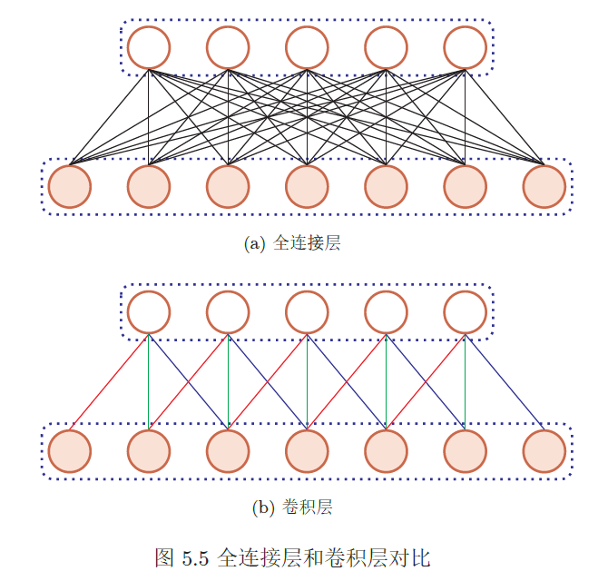
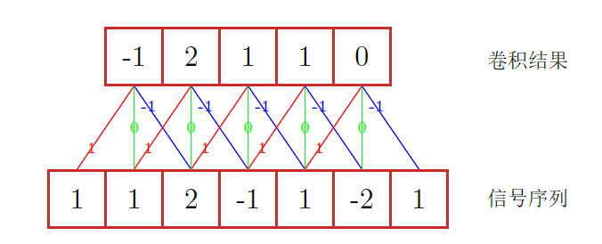
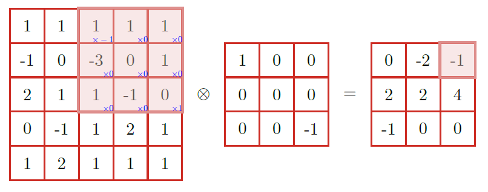
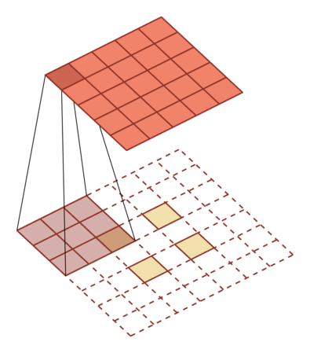
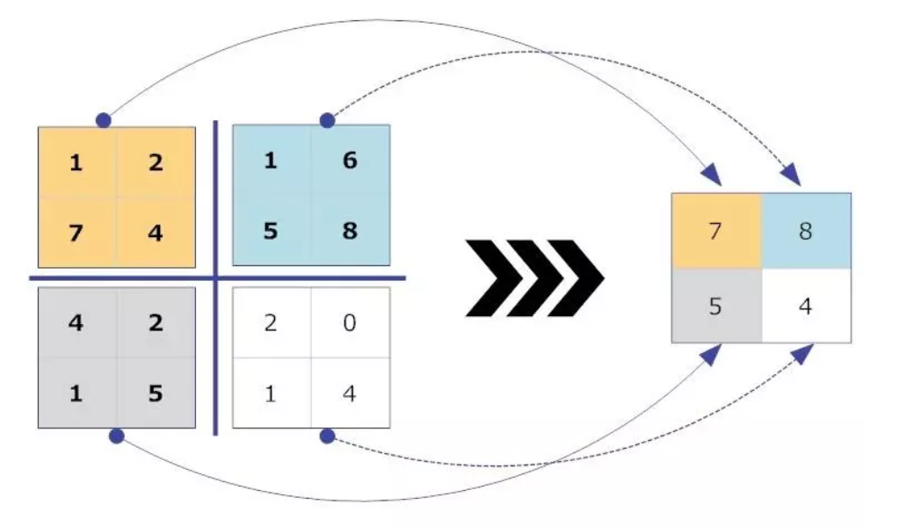
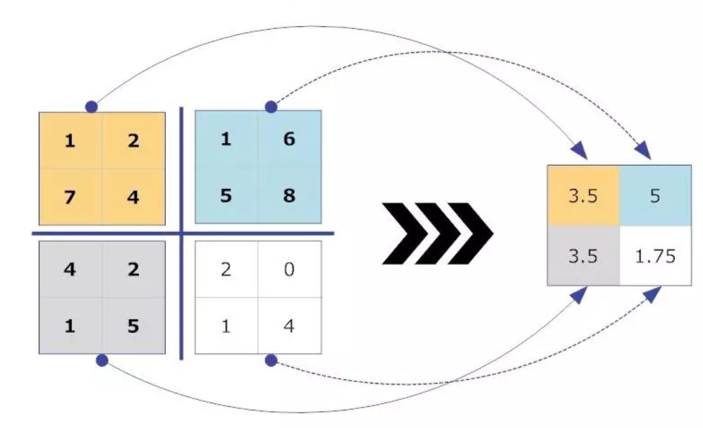
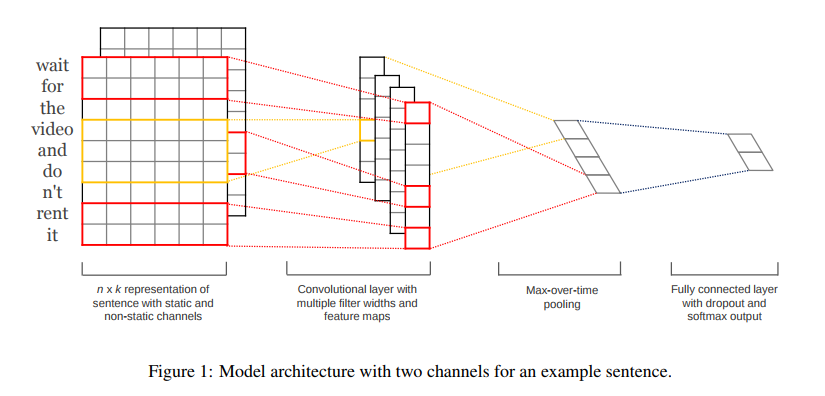
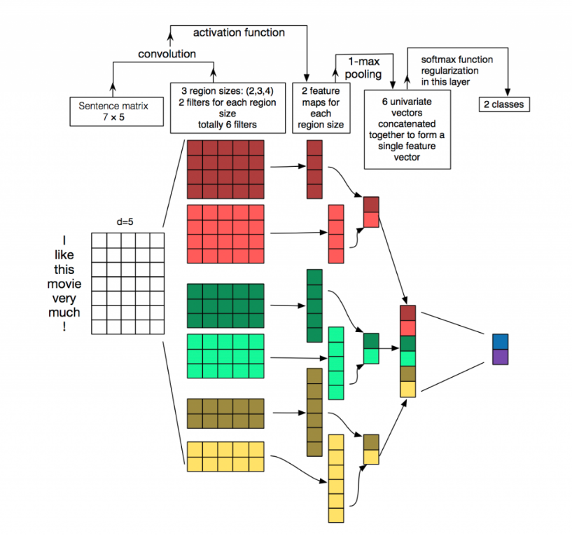

task-04

## 1. 卷积运算的定义、动机（稀疏权重、参数共享、等变表示）。一维卷积运算和二维卷积运算。

> 卷积到是什么？有什么用？具体是怎么样的？

### 1.1卷积运算的定义

> ​		在泛函分析中，卷积、旋积或摺积(英语：Convolution)是通过两个函数$f $和$g$ 生成第三个函数的一种数学算子，表征函数$f $与$g$ 经过翻转和平移的重叠部分的面积。
>
> ​		如果将参加卷积的一个函数看作区间的[指示函数](https://baike.baidu.com/item/指示函数/3774265)，卷积还可以被看作是“[滑动平均](https://baike.baidu.com/item/滑动平均/2640979)”的推广。
>
> ---参考[2]
>
> ​		数字图像处理里，两个矩阵相乘，如果其中一个保持不变，那么相当于用它代表的*操作*对另一个进行某种运算. 所以有时核也称为算子（operator）[4]。

> 从数学上讲，卷积就是一种运算。
>
> 我们称 ![[公式]](https://www.zhihu.com/equation?tex=%28f%2Ag%29%28n%29) 为 ![[公式]](https://www.zhihu.com/equation?tex=f%2Cg) 的卷积
>
> 其连续的定义为：
>
> 
> $$
> (f * g)(n)=\int_{-\infty}^{\infty} f(\tau) g(n-\tau) d \tau
> $$
> 其离散的定义为：
>
> 
> $$
> (f * g)(n)=\sum_{\tau=-\infty}^{\infty} f(\tau) g(n-\tau)
> $$
> ---参考[3]

卷积是一种运算，人为定义出来的，使用中更多为离散形式；

关于卷积运算的示例见1.3，更多说明见参考[3]，其中有举例说明离散和连续的情况。

### 1.2 动机（稀疏矩阵、参数共享、等变表示）

#### 1.2.1 稀疏矩阵

> 又可称为为局部连接、或是说稀疏连接；

> 输出的一个点只受到输入的一个f*f大小的矩阵决定，不受其他区域的影响。---参考[8]

#### 1.2.2 参数共享

> 作为参数的滤波器$w^{(l)}$ 对于第$l$层的所有的神经元都是相同的。如图5.5b中，所有的同颜色连接上的权重是相同的。
>
> 
>
> ---参考[1]

#### 1.2.3 等变表示(equivariant representations)

> 又可称为 :平移等变

> ​		对于卷积，参数共享的特殊形式使得神经网络具有对平移等变的性质。如果一个函数满足输入改变，输出也以同样的方式改变，就说它是等变的。 
> ​		卷积对其他的一些变换并不是天然等变的，例如对于图像的放缩或旋转变换，需要其他的机制来处理这些变换。
>
> ---参考[9] (实际来源为*花书*)

为什么会有平移不变性？

> 简单地说，卷积+最大池化约等于平移不变性。
>
> - 卷积：简单地说，图像经过平移，相应的特征图上的表达也是平移的。下图只是一个为了说明这个问题的例子。输入图像的左下角有一个人脸，经过卷积，人脸的特征（眼睛，鼻子）也位于特征图的左下角。
>
>   
>
>   假如人脸特征在图像的左上角，那么卷积后对应的特征也在特征图的左上角。
>
>   
>
>   在神经网络中，卷积被定义为不同位置的特征检测器，也就意味着，无论目标出现在图像中的哪个位置，它都会检测到同样的这些特征，输出同样的响应。比如人脸被移动到了图像左下角，卷积核直到移动到左下角的位置才会检测到它的特征。
>
> - 池化：比如最大池化，它返回感受野中的最大值，如果最大值被移动了，但是仍然在这个感受野中，那么池化层也仍然会输出相同的最大值。这就有点平移不变的意思了。
>
>   所以这两种操作共同提供了一些平移不变性，即使图像被平移，卷积保证仍然能检测到它的特征，池化则尽可能地保持一致的表达。

感觉可以理解为固有属性，就像水会结冰一样；

### 1.3 一维卷积运算和二维卷积运算

#### 1.3.1一维卷积运算

> ​		一维卷积经常用在信号处理中，用于计算信号的延迟累积。假设一个信号发生器每个时刻$t$ 产生一个信号$x_t$，其信息的衰减率为$w_k$，即在k − 1个时间步长后，信息为原来的$w_k$倍。假设$w_1 = 1,w_2 = 1/2,w_3 = 1/4$，那么在时刻$t$收到的信号$y_t $为当前时刻产生的信息和以前时刻延迟信息的叠加，
> $$
> \begin{aligned} y_{t} &=1 \times x_{t}+1 / 2 \times x_{t-1}+1 / 4 \times x_{t-2} \\ &=w_{1} \times x_{t}+w_{2} \times x_{t-1}+w_{3} \times x_{t-2} \\ &=\sum_{k=1}^{3} w_{k} \cdot x_{t-k+1} \end{aligned}
> $$
> ​		我们把$w_1,w_2$, · · · 称为滤波器（Filter）或卷积核（Convolution Kernel）。假设滤波器长度为m，它和一个信号序列$x_1, x_2$, · · · 的卷积为:
> $$
> y_{t}=\sum_{k=1}^{m} w_{k} \cdot x_{t-k+1}
> $$
> ​		信号序列x 和滤波器w的卷积定义为：
> $$
> \mathbf{y}=\mathbf{w} \otimes \mathbf{x}
> $$
> 其中⊗表示卷积运算。
>
> 一维卷积运算示例如下图，滤波器为[−1, 0, 1]，连接边上的数字为滤波器中的权重。
>
> 
>
> ---参考[1]

#### 1.3.2 二维卷积运算

> 二维卷积卷积也经常用在图像处理中。因为图像为一个两维结构，所以需要将一维卷积进行扩展。给定一个图像$X \in \mathbb{R}^{M \times N}$，和滤波器$W \in \mathbb{R}^{m \times n}$，一般$m << M, n << N$，其卷积为
> $$
> y_{i j}=\sum_{u=1}^{m} \sum_{v=1}^{n} w_{u v} \cdot x_{i-u+1, j-v+1}
> $$
> 二维卷积示例如下图：
>
> 
>
> ---参考[1]

**注意**：卷积核在运算时，旋转了180度，见上图；

> 若卷积核不翻转，进行同样操作，则称之为`互相关`,也可称为`不翻转卷积`，由于是否翻转与特征提取能力无关，特别是当卷积核是可学习的参数时，卷积和互相关是等价的，在诸多深度学习工具中卷积操作实际为互相关操作[1]。

动态演示-1[5]:

关于卷积后的维度计算，可见参考[6]

动态演示-2[7]

> 这里的卷积操作，准确讲应为`不翻转卷积`		

### 1.4 其他卷积运算[1]

滑动步长、零填充可增加卷积的多样性；

常用卷积分为窄卷积、宽卷积、等宽卷积；

> * 窄卷积（Narrow Convolution）：步长s = 1，两端不补零p = 0，卷积后输出长度为n − m + 1。
> * 宽卷积（Wide Convolution）：步长s = 1，两端补零p = m − 1，卷积后输出长度n + m − 1。
> * 等宽卷积（Equal-Width Convolution）：步长s = 1，两端补零p = (m −1)/2，卷积后输出长度n

转置卷积：**低维特征映射到高维特征的卷积操作**称为转置卷积（Transposed Convolution）[Dumoulin
and Visin, 2016]，也称为反卷积（Deconvolution）[Zeiler et al., 2011]。

微步卷积：步长s < 1 的转置卷积也称为微步卷积（Fractionally-Strided Convolution）[Long et al., 2015]。。为了实现微步卷积，我们可以在输入特征之间插入0 来间接地使得步长变小。

空洞卷积（Atrous Convolution）是一种不增加参数数量，同时增加输出单元感受野的一种方法，也称为膨胀卷积（Dilated Convolution）[Chen et al., 2018, Yu and Koltun, 2015];

空洞卷积通过给卷积核插入“空洞”来变相地增加其大小。如果在卷积核的每两个元素之间插入d − 1 个空洞，卷积核的有效大小为
$$
m^{\prime}=m+(m-1) \times(d-1)
$$
其中$d$ 称为膨胀率（Dilation Rate）。当d = 1 时卷积核为普通的卷积核。

|             m = 3, p = 0, s = 1             |             m = 3, p = 0, s = 1              |
| :-----------------------------------------: | :------------------------------------------: |
|  |  |
|                     d=1                     |                     d=2                      |

  m表示卷积核大小，p 表示零填充大小（zero-padding）， s 表示步长（stride），d表示膨胀率（dilation）。

参考

> [1] 邱锡鹏, 《神经网络与深度学习》， 2019
>
> [2] [百度百科-卷积](https://baike.baidu.com/item/卷积)
>
> [3] [知乎：如何通俗易懂地解释卷积？马同学](https://www.zhihu.com/question/22298352)
>
> [4] [卷积神经网络和图像分类识别](https://www.cnblogs.com/conmajia/p/annt-convolutional-neural-networks.html)
>
> [5] [深度学习简介(一)——卷积神经网络](https://www.cnblogs.com/alexcai/p/5506806.html)
>
> [6] [卷积神经网络（CNN）之一维卷积、二维卷积、三维卷积详解](https://www.cnblogs.com/szxspark/p/8445406.html)
>
> [7] [卷积神经网络CNN总结](https://www.cnblogs.com/skyfsm/p/6790245.html)
>
> [8] [卷积神经网络——卷积层、池化层和激活函数](https://www.jianshu.com/p/22b08ea31a73)
>
> [9] [深度学习之卷积网络](https://blog.csdn.net/u012151283/article/details/78158342)

## 2. 池化运算的定义、种类（最大池化、平均池化等）、动机。

### 2.1 定义

使用某一位置的相邻输出的总体统计特征来代替网络该位置的输出[1].

### 2.2 种类（最大池化、平均池化）

#### 2.2.1 最大池化

> 最大汇聚（Maximum Pooling）：一般是取一个区域内所有神经元的最大值。
>
> $$
> Y_{m, n}^{d}=\max _{i \in R_{m, n}^{d}} x_{i}
> $$
>
> 其中$x_i$ 为区域$ R_{m, n}^{d}$内每个神经元的激活值。
>
> ---参考[2]

> 参考[2] 中， 将`池化`称为`汇聚`,下同。

如图所示[3]：

#### 2.2.2 平均池化

> 平均汇聚（Mean Pooling）：一般是取区域内所有神经元的平均值。
> 
> $$
> Y_{m, n}^{d}=\frac{1}{\left|R_{m, n}^{d}\right|} \sum_{i \in R_{m, n}^{d}} x_{i}
> $$
> 
> 其中$\left|R_{m, n}^{d}\right|$为区域内神经元个数
>
> ---参考[2]

如图所示[3]：

### 2.3 动机

> 1. **特征不变形**：池化操作是模型更加关注是否存在某些特征而不是特征具体的位置。
>
> 2. **特征降维**：池化相当于在空间范围内做了维度约减，从而使模型可以抽取更加广范围的特征。同时减小了下一层的输入大小，进而减少计算量和参数个数。
>
> 3. **在一定程度上防止过拟合**，更方便优化。(由于参数的减少)
>
> 4. 提供了很强的**鲁棒性**（例如max-pooling是取一小块区域中的最大值，此时若此区域中的其他值略有变化，或者图像稍有平移，pooling后的结果仍不变）
> 5. **保持边界信息**，如果没有加padding的话，输入图片最边缘的像素点信息只会被卷积核操作一次，但是图像中间的像素点会被扫描到很多遍，那么就会在一定程度上降低边界信息的参考程度，但是在加入padding之后，在实际处理过程中就会从新的边界进行操作，就从一定程度上解决了这个问题。
> 6. 可以利用padding对输入尺寸有差异图片进行补齐，**使得输入图片尺寸一致**。(可回想Mask R-CNN开始前操作，统一图片尺寸，填零)
> 7. 卷积神经网络的**卷积层加入Padding**，可以使得卷积层的输入维度和输出维度一致。（应该指定的反卷积之后的操作)
>
> ---参考[4] [5] [6]

参考

> [1] lan Goodfellow等人, 《深度学习》, 2017
>
> [2] 邱锡鹏, 《神经网络与深度学习》， 2019
>
> [3] [池化层](https://www.jianshu.com/p/796d30d7dcca)
>
> [4] [深度学习—池化、padding的理解](https://www.cnblogs.com/eilearn/p/9282902.html)
>
> [5] [CNN学习笔记：池化层](https://www.cnblogs.com/MrSaver/p/10356695.html)
>
> [6] [4.2 Tensorflow笔记:池化函数](https://blog.csdn.net/fontthrone/article/details/76652762)

## 3. Text-CNN的原理

> 用 CNN 来提取句子中类似 n-gram 的关键信息.

> ## 简介
>
> TextCNN 是利用卷积神经网络对文本进行分类的算法，由 Yoon Kim 于2014年在 “Convolutional Neural Networks for Sentence Classification” 一文中提出的算法。
>
> ## 原理图
>
> 
>
> 
>
> 
>
> ## 结构详解
>
> ### 第一层
>
> 第一层是输入的7*5的词向量矩阵，词向量的维度为5，共7个单词。
>
> ### 第二层
>
> 第二层是卷积层，共有6个卷积核，尺寸为2×5、3*5、4×5，每个尺寸各2个，输入层分别与6个卷积核进行卷积操作，再使用激活函数激活，每个卷积核都得到了对应的feature maps。
>
> ### 第三层
>
> 第三层是池化层，使用1-max pooling提取出每个feature map的最大值，然后进行级联，得到6维的特征表示。
>
> ### 第四层
>
> 第四层是输出层，输出层使用softmax激活函数进行分类，在这层可以进行正则化操作（l2-regulariation）。
>
> ## 细节介绍
>
> ### feature
>
> 这里的特征就是词向量，词向量有静态和非静态的，静态的可以使用pre-train的，非静态的则可以在训练过程中进行更新，一般推荐非静态的fine-tunning方式，即以pre-train的词向量进行初始化，然后在训练过程中进行调整，它能加速收敛。
>
> ### channel
>
> 图像中可以利用 (R, G, B) 作为不同channel，而文本的输入的channel通常是不同方式的embedding方式（比如 word2vec或Glove），实践中也有利用静态词向量和fine-tunning词向量作为不同channel的做法。
>
> ### conv-1d
>
> 在TextCNN中用的是一维卷积（conv-1d），一维卷积带来的问题是需要设计通过不同size的filter获取不同宽度的视野。
>
> ### 1-max pooling
>
> 在TextCNN中用的是1-max pooling，当然也可以使用(dynamic) k-max pooling，在pooling阶段保留 k 个最大值，保留全局信息。
>
> ## 参数设置
>
> - 序列长度：一般设置为最大句子的长度
> - 类别数量：预测的类别的数量
> - 字典大小：即词汇数量
> - 嵌入长度：即每个词表示的词向量长度，训练词向量可以使用
> - word2cec、fasttext、glove等工具
> - 卷积核大小：对应n元语法的概念
> - 卷积核个数：卷积核大小对应的卷积核个数

参考：

> [1] [TextCNN详解](https://www.fashici.com/tech/190.html)

## 4. 利用Text-CNN模型来进行文本分类。

[Code_1](TextCNN-Tensor.py): 简单案例，数据量极少，代码简单；tensorlfow[2]

[Code_2](textcnn_case_2.py): 较为多详细的说明。[3] [4]

模型经验

> 在工作用到TextCNN做query推荐，并结合先关的文献，谈几点经验： 
> 1、TextCNN是一个n-gram特征提取器，对于训练集中没有的n-gram不能很好的提取。对于有些n-gram，可能过于强烈，反而会干扰模型，造成误分类。 
> 2、TextCNN对词语的顺序不敏感，在query推荐中，我把正样本分词后得到的term做随机排序，正确率并没有降低太多，当然，其中一方面的原因短query本身对term的顺序要求不敏感。隔壁组有用textcnn做博彩网页识别，正确率接近95%，在对网页内容（长文本）做随机排序后，正确率大概是85%。 
> 3、TextCNN擅长长本文分类，在这一方面可以做到很高正确率。 
>
> 4、TextCNN在模型结构方面有很多参数可调，具体参看文末的文献。
>
> ---参考[1]

参考

> [1] [大规模文本分类网络TextCNN介绍](https://blog.csdn.net/u012762419/article/details/79561441)---代码文件较为工程化，比较正式，含有一定的备注；但缺乏相关文件，无法直接运行，仅供参考
>
> [2] [graykode/nlp-tutorial](https://github.com/graykode/nlp-tutorial)
>
> [3] [文本分类实战（二）—— textCNN 模型](https://www.cnblogs.com/jiangxinyang/p/10207482.html)
>
> [4] [jiangxinyang227/textClassifier](https://github.com/jiangxinyang227/textClassifier)

