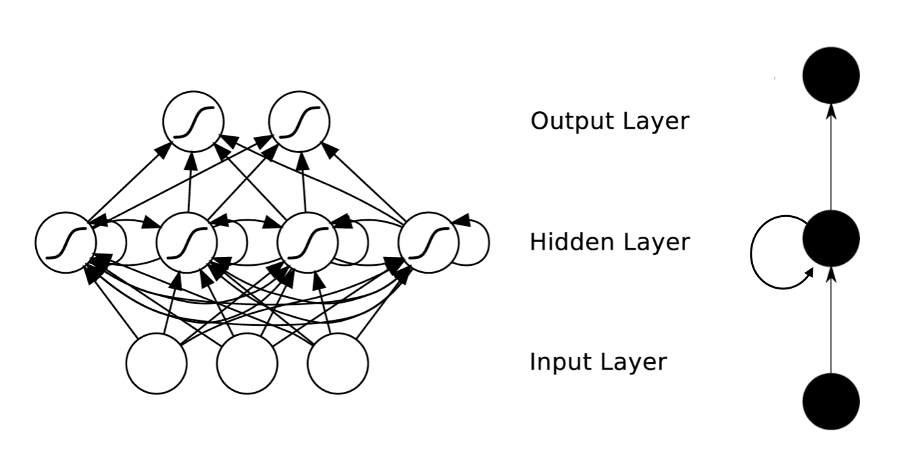
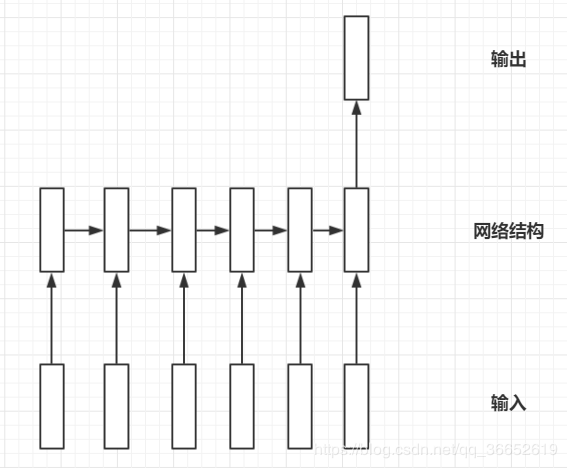
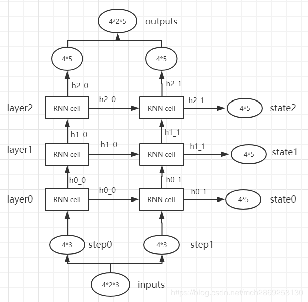

## 1. RNN的结构。循环神经网络的提出背景、优缺点。着重学习RNN的反向传播、RNN出现的问题（梯度问题、长期依赖问题）、BPTT算法。


### 1.1 RNN结构

#### 1.1.1 简述




 	RNNs包含输入单元(Input units)，输入集标记为${x_0,x_1,...,x_t,x_{t+1},...}$，而输出单元(Output units)的输出集则被标记为${y_0,y_1,...,y_t,y_{t+1}.,..}$。

​		RNNs还包含隐藏单元(Hidden units)，我们将其输出集标记为${s_0,s_1,...,s_t,s_{t+1},...}$，这些隐藏单元完成了最为主要的工作。 

​		一个标准的(简单的)RNN单元包含三层: **输入层,隐藏层和输出层**,用图示有两种方式:折叠式(左)与展开式(右):


​		例如，对一个包含5个单词的语句，那么展开的网络便是一个五层的神经网络，每一层代表一个单词。对于该网络的计算过程如下：

* $x_t$表示第$t,t=1,2,3...t,$步(step)的输入。比如，$x_1$为第二个词的词向量(根据上图，$x_0$为第一个词)； 

* $s_t$为隐藏层的第$t$步的状态，它是网络的记忆单元。

  $s_t$根据当前输入层的输出与上一步隐藏层的状态进行计算。$s_{t}=f\left(U x_{t}+W s_{t-1}\right)$，其中$f$一般是非线性的激活函数，如tanh或ReLU;

  > 在计算$s_0$时，即第一个单词的隐藏层状态，需要用到$s_{−1}$，但是其并不存在，在实现中一般置为0向


* $o_t$是第$t$步的输出，如下个单词的向量表示，$o_t=g(V_{st})$. 

计算简化如下
$$
\begin{aligned} \mathbf{o}_{t} &=g\left(V \mathbf{s}_{t}\right) \\ \mathbf{s}_{t} &=f\left(U \mathbf{x}_{t}+W \mathbf{s}_{t-1}\right) \end{aligned}
$$


在训练时，模型采用交叉熵来计算损失函数。


> **需要注意的是**：
>
> - 隐藏层状态$s_t$是网络的记忆单元. $s_t$包含了前面所有步的隐藏层状态。而输出层的输出$o_t$只与当前步的$s_t$有关，在实践中，为了降低网络的复杂度，往往$s_t$只包含前面若干步而不是所有步的隐藏层状态；
>
> - 在传统神经网络中，每一个网络层的参数是不共享的。
>
>   而在RNNs中，每输入一步，每一层各自都共享参数$U,V,W$。其反应者RNNs中的每一步都在做相同的事，只是输入不同，因此大大地降低了网络中需要学习的参数；
>
>   这里并没有说清楚，解释一下，传统神经网络的参数是不共享的，并不是表示对于每个输入有不同的参数，而是将RNN是进行展开，这样变成了多层的网络，
>
>   如果这是一个多层的传统神经网络，那么$x_t$到$s_t$之间的U矩阵与$x_{t+1}$到$s_{t+1}$之间的$U$是不同的，而RNNs中的却是一样的，同理对于$s$与$s$层之间的$W$、$s$层与$o$层之间的$V$也是一样的。
>
> - 上图中每一步都会有输出，但是每一步都要有输出并不是必须的。
>
>   比如，我们需要预测一条语句所表达的情绪，我们仅仅需要关系最后一个单词输入后的输出，而不需要知道每个单词输入后的输出。同理，每步都需要输入也不是必须的。RNNs的关键之处在于隐藏层，隐藏层能够捕捉序列的信息。
>
> --- 参考[1]


#### 1.1.2 模型结构类型

不同的任务类型，有着不同的模型结构


> 它一般可以处理三种类型的任务：1. 输入不固定，输出固定单一（多对一问题）2. 输入固定单一，输出不固定（一对多问题） 3. 输入和输出都不固定（多对多问题）
>
> 多对一问题
> 这样的问题的模型结构一般是这样的：
>
> 
>
> 输入可能是一句话，输出是一个固定的输出，这种情况下卷积神经网络可能是无法处理的，这就需要循环神经网络，这样的问题对应到任务上有：**文本分类、情感分析**（给一句评论输出这句话的情感态度）
>
>  
>
> 一对多问题
> 一对多问题的模型结构一般是这样的：
>
> 
>
> 这种问题可能输入是一张图片，输出是一句话对吧，常见任务很经典的就是：**Image Caption**（当然输入前也是要加一层CNN抽特征的）
>
>  
>
> 多对多问题
>
> 
>
> 对于这种多对多的问题我们也称为序列到序列的问题（Seq2Seq），最经典的毫无疑问就是**机器翻译**了，输入一个源语言的句子，输出一个目标语言的句子。
>
> ---参考[2]


### 1.2 RNN的提出背景

* RNN在处理序列类型数据时，效果比NN、CNN效果好，RNN带有动态记忆特征；

* NN、CNN等网络，输入数据时，是相会独立的；进而其考虑序列类型数据时无法考虑序列之间的相关性；

* NN、CNN在input和output时，长度都是固定的，而无法处理非等长的数据，但RNN可以[2]；

  > 在对神经网络输入‘句子’时，句子的长度无法控制使之等长。


### 1.3 RNN优缺点


### 1.4 RNN的反向传播[2]

其过程是序列的尾部到头部的过程，设E为Loss的值，梯度下降现在E要对每个参数进行求偏导，保证每个方向都成下降趋势。


可以看到参数矩阵都是共享的，每一步的W都是一样的，可以看成是一个变量。

我们计算对W的偏导计算梯度 ：

$$
\frac{\partial E}{\partial W}=\sum_{0}^{t} \frac{\partial E_{t}}{\partial W}
$$
通过一个变换：

$$
\frac{\partial E_{t}}{\partial W}=\frac{\partial E_{t}}{\partial y_{t}} \frac{\partial y_{t}}{\partial s_{t}} \frac{\partial s_{t}}{\partial W}
$$
但$s_{t}$对W求偏导是比较困难的，通过上面的公式可以知道$s_{t}$是$s_{t-1}的$函数：

$s_{t}=f\left(U x_{t}+W s_{t-1}\right)$（正向传播中的公式）

那么，知道这一点我们的公式可以变换为：

$$
\frac{\partial E_{t}}{\partial W}=\frac{\partial E_{t}}{\partial y_{t}} \frac{\partial y_{t}}{\partial s_{t}}\left(\prod_{i=j+1}^{t} \frac{\partial s_{i}}{\partial s_{i-1}}\right) \frac{\partial s_{j}}{\partial W}
$$
当 j = 0的时候，对W求偏导是比较容易的，那么我们的反向传播的机制就会变成如下的一个流程：


它会从当前时间的损失，一直反向传播到最开始的状态，影响到最开始的节点。


### 1.5 RNN存在的问题


#### 1.5.1 梯度消失

与激活函数Tanh有关以及梯度更新公式$\frac{\partial E_{t}}{\partial y_{t}} \frac{\partial y_{t}}{\partial s_{t}}\left(\prod_{i=j+1}^{t} \frac{\partial s_{i}}{\partial s_{i-1}}\right) \frac{\partial s_{j}}{\partial W}$有关


由于存在连乘，若当$\frac{\partial s_{i}}{\partial s_{i-1}}$的值存在多个小于1时，甚至小于0.1时，会导致当步长越长时，对梯度的影响越小，最终导致梯度消失


解决方法：

* 只在特定区域内进行反向传播，以减少步长(如只在黄色区域进行反向传播)[2]

  

* 使用LSTM[4]


#### 1.5.1 信息过载

> 也不知道是不是一个问题，但存在这样的情况

由于RNN中隐藏层中共享参数$U,V,W$，当输入多条数据时，其无法承载（或说'记住'）这么数据含有的信息[2]；


解决方法：

* LSTM


### 1.6 BPTT算法

> 主要看了以下两篇博客，很棒，但现在心情有点激动，不太能马上平静下来，就暂且不看；
>
> 日后补上！


整个推导思路：

>  BPTT 的误差项沿两个方向传播,一个是从当前层传上向一层,另一个是从当前时刻传到上一时刻(在处理时域反向传播时,最好把这个循环展开(unfold)这样,结构就像一个层的全连接网络了,只不过权值共享)---TS[2]


参考如下：

TS[1] [零基础入门深度学习(5) - 循环神经网络](https://www.zybuluo.com/hanbingtao/note/541458)

TS[2] [时间序列(五): 大杀器: 循环神经网络](https://www.cnblogs.com/vpegasus/p/rnn.html)

TS[3] [循环神经网络（RNN）浅析](https://www.jianshu.com/p/87aa03352eb9)


> 在TS[2]有个地方有问题，应该如下：
> $$
> \begin{array}
> \\
> \delta_j^l &= &\partial L / \partial z_j^l \\
> & = & \sum_k \frac{\partial z_{k}^{l+1}}{\partial z_j^l}\frac{\partial L}{\partial z_k^{l+1}}\\
> &=& \sum_k \frac{\partial z_{k}^{l+1}}{\partial z_j^l}\delta_k^{l+1}\\
> & =& \sum_k w_{k,j}^{l+1}\delta_k^{l+1}\sigma'(z_j^l)
> \end{array}
> $$
> 结合自己推导和博主下文说明：
> $$
> \begin{array}
> \\
> \frac{\partial z_k^{l+1}}{\partial z_j^l} &=& \frac{\partial (\sum_j w_{k,j}^{l+1}\sigma(z_j^l)+b_k^{l+1})}{\partial z_j^l} \\
> &=&  w_{k,j}^{l+1}\sigma'(z_j^l)
> \end{array}
> $$
> 


## 2. 双向RNN


* **双向RNN提出背景**

在原本RNN是考虑正向的方向输入的基础上，同时考虑两个正向、方向两个方向上的输入


* **双向RNN结构**


在一个cell内：

$x_t$同时向正向链上的隐藏层神经元$A$和反向链上的隐藏层神经元$A'$传递值；

同时输出$y_t$也受到神经元$A$和$A'$的影响


* **双向RNN优缺点**


好处

​		原本只可以接受到上文信息，通过双向的网络结构，可同时接受上下文信息，将两个隐含状态做拼接给到输出。提高语言的表达能力[2]。

 

不足

​		无法用于实时任务（只有上文而没有下文）[2]


## 3. 递归神经网络


* 提出背景

解决可变长度的输入有两个，一个是循环，进而有循环神经网络，另一即为迭代；

前者对应有循环神经网络，后者对应即为递归神经网络；

解决了语法解析树的问题，对同一个个句子，不同的拆分有着不同的意思。

> 因为神经网络的输入层单元个数是固定的，因此必须用循环或者递归的方式来处理长度可变的输入。**循环神经网络**实现了前者，通过将长度不定的输入分割为等长度的小块，然后再依次的输入到网络中，从而实现了神经网络对变长输入的处理。一个典型的例子是，当我们处理一句话的时候，我们可以把一句话看作是词组成的序列，然后，每次向**循环神经网络**输入一个词，如此循环直至整句话输入完毕，**循环神经网络**将产生对应的输出。如此，我们就能处理任意长度的句子了。入下图所示：
>
> 
>
> 然而，有时候把句子看做是词的序列是不够的，比如下面这句话『两个外语学院的学生』：
>
> 
>
> 上图显示了这句话的两个不同的语法解析树。可以看出来这句话有歧义，不同的语法解析树则对应了不同的意思。一个是『两个外语学院的/学生』，也就是学生可能有许多，但他们来自于两所外语学校；另一个是『两个/外语学院的学生』，也就是只有两个学生，他们是外语学院的。为了能够让模型区分出两个不同的意思，我们的模型必须能够按照树结构去处理信息，而不是序列，这就是**递归神经网络**的作用。当面对按照树/图结构处理信息更有效的任务时，**递归神经网络**通常都会获得不错的结果。
>
> **递归神经网络**可以把一个树/图结构信息编码为一个向量，也就是把信息映射到一个语义向量空间中。这个语义向量空间满足某类性质，比如语义相似的向量距离更近。也就是说，如果两句话（尽管内容不同）它的意思是相似的，那么把它们分别编码后的两个向量的距离也相近；反之，如果两句话的意思截然不同，那么编码后向量的距离则很远。如下图所示：
>
> 
>
> 从上图我们可以看到，**递归神经网络**将所有的词、句都映射到一个2维向量空间中。句子『the country of my birth』和句子『the place where I was born』的意思是非常接近的，所以表示它们的两个向量在向量空间中的距离很近。另外两个词『Germany』和『France』因为表示的都是地点，它们的向量与上面两句话的向量的距离，就比另外两个表示时间的词『Monday』和『Tuesday』的向量的距离近得多。这样，通过向量的距离，就得到了一种语义的表示。
>
> 上图还显示了自然语言**可组合**的性质：词可以组成句、句可以组成段落、段落可以组成篇章，而更高层的语义取决于底层的语义以及它们的组合方式。**递归神经网络**是一种表示学习，它可以将词、句、段、篇按照他们的语义映射到同一个向量空间中，也就是把可组合（树/图结构）的信息表示为一个个有意义的向量。比如上面这个例子，**递归神经网络**把句子"the country of my birth"表示为二维向量[1,5]。有了这个『编码器』之后，我们就可以以这些有意义的向量为基础去完成更高级的任务（比如情感分析等）。如下图所示，**递归神经网络**在做情感分析时，可以比较好的处理否定句，这是胜过其他一些模型的：
>
> 
>
> 在上图中，蓝色表示正面评价，红色表示负面评价。每个节点是一个向量，这个向量表达了以它为根的子树的情感评价。比如"intelligent humor"是正面评价，而"care about cleverness wit or any other kind of intelligent humor"是中性评价。我们可以看到，模型能够正确的处理doesn't的含义，将正面评价转变为负面评价。
>
> --- 参考[6]


* 网络结构

> **递归神经网络**的输入是两个子节点（也可以是多个），输出就是将这两个子节点编码后产生的父节点，父节点的维度和每个子节点是相同的。如下图所示：
>
> 
>
> 和分别是表示两个子节点的向量，是表示父节点的向量。子节点和父节点组成一个全连接神经网络，也就是子节点的每个神经元都和父节点的每个神经元两两相连。
>
> ---参考[6]


* 优缺点

  缺点： 

  * 由于递归神经网络输入是树或图的形式，这类数据需要大量的人工去标注；而与之带来的性能提升，人工标注代价与之相比并不划算[6].

  优点：

  * 简洁


## 4. LSTM、GRU的结构、提出背景、优缺点。


### 4.1 LSTM提出背景

RNN效果不好，存在梯度消失等问题


### 4.2 LSTM结构

* LSTM是在RNN的单元上进行扩展，加入**选择性机制**：
  * Input Gate(输入门):  控制是否输入单元内
  * Forget Gate(遗忘门):  控制是否记住之前的信息
  * Output Gate(输出门):  控制该单元储存的值是否向外输出


> 一个单元有四个输入，一个输出


* 选择性机制的实现

  通过"门"机制，比如遗忘门等，其实际是通过Sigmoid的函数，Sigmoid的输出是0或者1，那么当一个值经过这个Sigmoid后若输出是0，选择将其遗忘，输出是1的话，选择将其记下来。


* 单个LSTM单元的计算情况

  

其中$c$为原先单元内储存的值，$c'$为更新后的值;

$z,z_i,z_f,z_o$分别为经过输入$x^{t}$乘以不同的权重向量得到的，具体示意图如下：


> 注：图中，假设单元内储存的值为0；各权重也均为假设

经典的LSTM单元表示如下：


其中与上述不同的是，此处将上一个单元的输出$h_{t-1}$和$x_t$当前输入同时作为输入，输入至单元中。


### 4.3 LSTM优缺点


优点：可以拟合序列数据，通过遗忘门和输出门忘记部分信息来解决梯度消失的问题。

缺点: 计算复杂度高


### 4.4 GRU提出背景

考虑到LSTM网络输入们和遗忘门之间有一些互补的关系，因此同时使用两个门机制显得有些冗余。

于是思考将输入门和遗忘门进行合并，合并的思路如下：


### 4.5 GRU结构


1. 将输入门、遗忘门、输出门变为两个门：更新门（Update Gate）和重置门（Reset Gate）。
2. 将单元状态与输出合并为一个状态$h$：
3. 去除 LSTM 中的内部细胞记忆单元$c_t$ ， 直接在当前状态$h_{t}$和历史状态 $h_{t-1}$之间引入线性依赖关系 


### 4.4 GRU优缺点


一般情况下：LSTM与GRU性能上差不多；但由于GRU参数更少，可以更快收敛；

在大型数据集上LSTM的性能会好于FRU。[8]


## 5. 针对梯度消失（LSTM等其他门控RNN）、梯度爆炸（梯度截断）的解决方案。


### 5.1 产生梯度消失或梯度爆炸的原因


主要原因是在梯度的更新式中对权重求导时
$$
\frac{\partial E_{t}}{\partial W}=\frac{\partial E_{t}}{\partial y_{t}} \frac{\partial y_{t}}{\partial s_{t}}\left(\prod_{i=j+1}^{t} \frac{\partial s_{i}}{\partial s_{i-1}}\right) \frac{\partial s_{j}}{\partial W}
$$
若其中$\prod_{i=j+1}^{t} \frac{\partial s_{i}}{\partial s_{i-1}}$多个值小于1，连乘后使得整个值特别小，最终导致梯度消失；

若其中$\prod_{i=j+1}^{t} \frac{\partial s_{i}}{\partial s_{i-1}}$多个值大于1，连乘后使得整个值将特别大，最终导致梯爆炸；


### 5.2 解决方案


梯度裁剪和LSTM

> * 梯度裁剪（Clipping Gradient） 
>   既然在BP过程中会产生梯度消失（就是偏导无限接近0，导致长时记忆无法更新），那么最简单粗暴的方法，设定阈值，当梯度小于阈值时，更新的梯度为阈值，如下图所示： 
>
> 
>
> ​		优点：简单粗暴 
> ​		缺点：很难找到满意的阈值
>
> * LSTM（Long Short-Term Memory） 
>   一定程度上模仿了长时记忆，相比于梯度裁剪，最大的优点就是，自动学习在什么时候可以将error反向传播，自动控制哪些是需要作为记忆存储在LSTM cell中。一般长时记忆模型包括写入，读取，和忘记三个过程对应到LSTM中就变成了input_gate,output_gate,forget_gate,三个门，范围在0到1之间，相当于对输入输出进行加权的学习，利用大量数据来自动学习加权的参数（即学习了哪些错误可以用BP更新参数），LSTM的示意图如下： 
>
> 
>
> ​		具体的公式表达： 
> $$
> \begin{array}{l}{i_{t}=\operatorname{sigm}\left(\theta_{i x} x_{t}+\theta_{i h} h_{t-1}+b_{i}\right)} \\ {o_{t}=\operatorname{sigm}\left(\theta_{o x} x_{t}+\theta_{o h} h_{t-1}+b_{o}\right)} \\ {f_{t}=\operatorname{sigm}\left(\theta_{f x} x_{t}+\theta_{f h} h_{t-1}+b_{f}\right)} \\ {g_{t}=\tanh \left(\theta_{g x} x_{t}+\theta_{g h} h_{t-1}+b_{g}\right)} \\ {c_{t}=i_{t} \odot g_{t}+f_{t} \odot c_{t-1}} \\ {h_{t}=o_{t} \odot \operatorname{Tanh}\left(c_{t}\right)}\end{array}
> $$
> ​		优点：模型自动学习更新参数
>
> ---参考[10]
>


面对梯度消失，将激活函数换为ReLu

> 感觉这么有点太强求了

> 面对梯度消失问题，可以采用ReLu作为激活函数，下图为ReLu函数
>
> ReLu函数及其导函数
>
> ReLU函数在定义域大于0部分的导数恒等于1，这样可以解决梯度消失的问题。
>
> 另外计算方便，计算速度快，可以加速网络训练。但是，定义域负数部分恒等于零，这样会造成神经元无法激活（可通过合理设置学习率，降低发生的概率）。
>
> ReLU有优点也有缺点，其中的缺点可以通过其他操作取避免或者减低发生的概率，是目前使用最多的激活函数。
>
> ---参考[11]


1-5的参考：

> [1] [循环神经网络(RNN, Recurrent Neural Networks)介绍](https://blog.csdn.net/heyongluoyao8/article/details/48636251)
>
> [2] [自然语言菜鸟学习笔记（七）：RNN（循环神经网络）及变体（LSTM、GRU）理解与实现（TensorFlow）](https://blog.csdn.net/qq_36652619/article/details/95952068)
>
> [3] [为什么要用RNN，不能把时间序列的数据都作为特征值输入么？ ](https://www.zhihu.com/question/307684557) [阳谦知答](https://www.zhihu.com/people/young-dou)
>
> [4] [【李宏毅 深度学习19（完整版）国语】机器学习 深度学习](https://www.bilibili.com/video/av48285039/?p=45)P43 
>
> [5] [时间序列(五): 大杀器: 循环神经网络](https://www.cnblogs.com/vpegasus/p/rnn.html)
>
> [6] [零基础入门深度学习(7) - 递归神经网络](https://zybuluo.com/hanbingtao/note/626300)
>
> [7] [LSTM原理与实践，原来如此简单](https://zhuanlan.zhihu.com/p/51870057)
>
> [8] [LSTM 和GRU的区别](https://blog.csdn.net/u012223913/article/details/77724621)
>
> [9] [RNN梯度消失和爆炸的原因](https://zhuanlan.zhihu.com/p/28687529)
>
> [10] [【深度学习】RNN中梯度消失的解决方案（LSTM）](https://blog.csdn.net/qq_29340857/article/details/70574528)
>
> [11] [RNN梯度消失与梯度爆炸的原因](https://zhuanlan.zhihu.com/p/53405950)


## 6. Memory Network（自选）


* 想法

RNN、LSTM的记忆力还是太弱了，需要一个记忆力更强的模型；

出现在更多对话系统中；


* 模型结构


> I：用于将输入转化为网络里内在的向量。作者使用了简单的向量空间模型，维度为3*lenW+3（熟悉VSM会问为什么不是lenW，下面会说具体）。 
> G：更新记忆。在作者的具体实现里，只是简单地插入记忆数组里。作者考虑了几种新的情况，虽然没有实现，包括了记忆的忘记，记忆的重新组织。 
> O：从记忆里结合输入，把合适的记忆抽取出来，返回一个向量。 
> R：将该向量转化回所需的格式，比如文字或者answer。对于R来说，最简单的是，直接返回o的第一个支撑记忆，也就是一句话。当然作者，打算弄复杂点，返回一个词汇w。 
>


参考

> [1] [记忆网络之Memory Networks](https://zhuanlan.zhihu.com/p/29590286)
>
> [2] [Memory Networks原理及其代码解析](https://blog.csdn.net/u011274209/article/details/53384232)


## 7. Text-RNN的原理。


> 即为RNN原理 


## 8. 利用Text-RNN模型来进行文本分类。


### 8.1 关于tensorflow中相关代码的理解


#### 8.1.1 `tf.nn.rnn_cell.LSTMCell`

> 创建一个LSTM单元，相当于告诉tensorflow，我要使用LSTM单元啦；
>
> 由于在RNN的单元个数，由输入长度决定的，故而也就没有要用多少个`LSTMcell`
>
> > **Warning:** THIS FUNCTION IS DEPRECATED. It will be removed in a future version. Instructions for updating: This class is equivalent as `tf.keras.layers.LSTMCell`, and will be replaced by that in Tensorflow 2.0. 


但有一个需要注意的是，参数`num_units`，这个指的是，LSTM内部的隐藏层有多少个单元;

还句话说，LSTM单元的输出是多少维的；

> 假设在我们的训练数据中，每一个样本 x 是 28*28 维的一个矩阵，那么将这个样本的每一行当成一个输入，通过28个时间步骤展开LSTM，在每一个LSTM单元，我们输入一行维度为28的向量，如下图所示。
>
> 
>
> 那么，对每一个LSTM单元，参数 num_units=128 的话，就是每一个单元的输出为 128*1 的向量，在展开的网络维度来看，如下图所示，对于每一个输入28维的向量，LSTM单元都把它映射到128维的维度， 在下一个LSTM单元时，LSTM会接收上一个128维的输出，和新的28维的输入，处理之后再映射成一个新的128维的向量输出，就这么一直处理下去，知道网络中最后一个LSTM单元，输出一个128维的向量。
>
> 
>
> 从LSTM的公式的角度看是什么原理呢？我们先看一下LSTM的结构和公式：
>
> 
>
> 参数 num_units=128 的话，
>
> 1. 对于公式 (1) ，h=128 \* 1 维， x=28\*1 维，[h,x]便等于156\*1 维，W=128\*156 维，所以 W*[h,x]=128\*156 * 156\*1=128\*1, b=128\*1 维, 所以 f=128\*1+128\*1=128\*1 维；
> 2. 对于公式 (2) 和 (3)，同上可分析得 i=128\*1 维，C(~)=128\*1 维;
> 3. 对于公式 (4) ，f(t)=128\*1, C(t-1)=128\*1, f(t) .\* C(t-1) = 128\*1 .\* 128\*1 = 128\*1 , 同理可得 C(t)=128\*1 维;
> 4. 对于公式 (5) 和 (6) ， 同理可得 O=128\*1 维， h=O.*tanh(C)=128\*1 维。
>
> 所以最后LSTM单元输出的h就是 128\*1 的向量。
>
> 
>
> ---参考[3]


参数

```python
__init__(    num_units,    
      use_peepholes=False, 
      cell_clip=None,
      initializer=None, 
      num_proj=None,
      proj_clip=None, 
      num_unit_shards=None,
      num_proj_shards=None,
      forget_bias=1.0, 
      state_is_tuple=True, 
      activation=None,
      reuse=None, 
      name=None, 
      dtype=None,
      **kwargs)
```


#### 8.1.2 ` tf.nn.dynamic_rnn`

> 创建了LSTMcell后，就把它放入相应那一层网络中，就是放入 ` tf.nn.dynamic_rnn`中；
>
> > **Warning:** THIS FUNCTION IS DEPRECATED. It will be removed in a future version. Instructions for updating: Please use `keras.layers.RNN(cell)`, which is equivalent to this API


主要的参数为：

`cell`：告诉网络使用什么单元，如`tf.nn.rnn_cell.LSTMCell`，先实例化在给到 ` tf.nn.dynamic_rnn`；

`input`：设置这一层网络的输入；

```python
cell = tf.nn.rnn_cell.LSTMCell(n_hidden)   
outputs, states = tf.nn.dynamic_rnn(cell, X, dtype=tf.float32)
```


输出说明：

outputs：每一个cell的输出

states: 最后一个cell的输出

备注：其中`batch_size`指的是当前一组数据中有多少个输入（如下图中，有四组输入，每组分对应不同的cell，每个cell每次输入为3维；


> 一对(outputs, state),其中：
>
> outputs： RNN输出Tensor.
>
> ​		如果time_major == False(默认),这将是shape为[batch_size, max_time, cell.output_size]的Tensor.
>
> ​		如果time_major == True,这将是shape为[max_time, batch_size, cell.output_size]的Tensor.
>
> state： 最终的状态.
>
> ​		一般情况下state的形状为 [batch_size, cell.output_size ]
> 如果cell是LSTMCells,则state将是包含每个单元格的LSTMStateTuple的元组，state的形状为[2，batch_size, cell.output_size ]
>
> 
>
> 单层：
>
> 
>
> 多层：
>
> 
>
> ---参考[6] (更多详细说明可见此)


参数

```python
tf.nn.dynamic_rnn(
    cell,
    inputs,
    sequence_length=None,
    initial_state=None,
    dtype=None,
    parallel_iterations=None,
    swap_memory=False,
    time_major=False,
    scope=None
)
```


### 8.2 案例代码

[Code_1](TextRNN-Tensor.py)

[Code_2](run_rnn.py)


7-8参考

> [1] [graykode/nlp-tutorial](https://github.com/graykode/nlp-tutorial)
>
> [2] [gaussic/text-classification-cnn-rnn](https://github.com/gaussic/text-classification-cnn-rnn)
>
> [3] [tf.nn.rnn_cell.LSTMCell中num_units参数解释](http://www.mtcnn.com/?p=529)
>
> [4] [tf.nn.rnn_cell.LSTMCell](https://tensorflow.google.cn/versions/r1.13/api_docs/python/tf/nn/rnn_cell/LSTMCell)
>
> [5] [tf.nn.dynamic_rnn的输出outputs和state含义](https://blog.csdn.net/u010960155/article/details/81707498)
>
> [6] [tf.nn.dynamic_rnn返回值详解](https://blog.csdn.net/mch2869253130/article/details/89280203)
>
> 


## 9. Recurrent Convolutional Neural Networks（RCNN）原理。


> 本文要解决的问题是文本分类，文本分类最关键的问题是特征表示，传统的方法经常会忽略上下文信息和词序，无法捕捉到词义。近几年随着深度学习的火热，研究者们通过借助神经网络模型来解决传统方法存在的问题。比如：Socher提出的Recursive Neural Network（递归神经网络）模型，通过一种树结构来捕捉句子语义，取得了不错的效果，但时间复杂度是O(n2)，并且无法用一棵树来表示两个句子之间的关系。再比如：Recurrent Neural Network（循环神经网络）模型，时间复杂度是O(n)，每个单词的表示都包含了之前所有单词的信息，有很强的捕捉上下文的能力，但该模型有偏，后面的单词比前面的单词更重要，但这与常识并不相符，因为句中关键的词不一定在最后面。为了解决RNN的有偏性问题，有的研究者提出了用CNN（卷积神经网络）来表示文本，并且时间复杂度也是O(n)，但是CNN存在一个缺陷，卷积窗口的大小是固定的，并且这个窗口大小如何设置是一个问题，如果设置小了，则会损失有效信息，如果设置大了，会增加很多的参数。
>
> 
>
> 于是，针对上述模型存在的问题，本文提出了RCNN（循环卷积神经网络）模型，模型架构图如下：
>
> 
>
> 
>
> 首先，构造CNN的卷积层，卷积层的本质是一个BiRNN模型，通过正向和反向循环来构造一个单词的下文和上文，如下式：
> $$
> \begin{aligned} \boldsymbol{c}_{l}\left(w_{i}\right) &=f\left(W^{(l)} \boldsymbol{c}_{l}\left(w_{i-1}\right)+W^{(s l)} \boldsymbol{e}\left(w_{i-1}\right)\right) \\ \boldsymbol{c}_{r}\left(w_{i}\right) &=f\left(W^{(r)} \boldsymbol{c}_{r}\left(w_{i+1}\right)+W^{(s r)} \boldsymbol{e}\left(w_{i+1}\right)\right) \end{aligned}
> $$
> 得到单词的上下文表示之后，用拼接的方式来表示这个单词，如下式：
> $$
> \boldsymbol{x}_{i}=\left[\boldsymbol{c}_{l}\left(w_{i}\right) ; \boldsymbol{e}\left(w_{i}\right) ; \boldsymbol{c}_{r}\left(w_{i}\right)\right]
> $$
> 将该词向量放入一个单层神经网络中，得到所谓的潜语义向量（latent semantic vector），这里卷积层的计算结束了，时间复杂度仍是O(n)。接下来进行池化层（max-pooling），即将刚刚得到的所有单词的潜语义向量中每个维度上最大的值选出组成一个新的向量，这里采用max-pooling可以将向量中最大的特征提取出来，从而获取到整个文本的信息。池化过程时间复杂度也是O(n)，所以整个模型的时间复杂度是O(n)。得到文本特征向量之后，进行分类。
>
> ---参考[1]


## 10. 利用RCNN模型来进行文本分类。


[Code](RCNN.ipynb)


9-10参考

> [1] [Recurrent Convolutional Neural Networks for Text Classification](https://mp.weixin.qq.com/s/1iUs0aFcMw3gtt6slPXBKQ)
>
> [2] Siwei Lai, Liheng Xu, Kang Liu, Jun Zhao, Recurrent Convolutional Neural Networks for Text Classification, AAAI,2016
>
> [3] [论文笔记：Recurrent Convolutional Neural Networks for Text Classification](https://blog.csdn.net/vivian_ll/article/details/80975135)
>
> [4] [jiangxinyang227/textClassifier](https://github.com/jiangxinyang227/textClassifier)