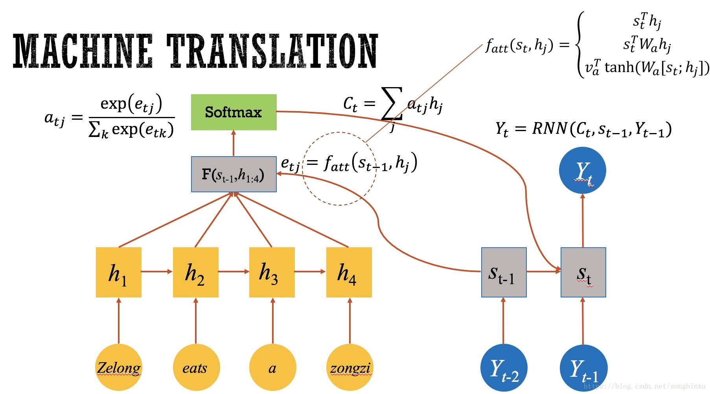
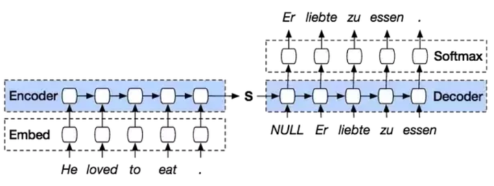
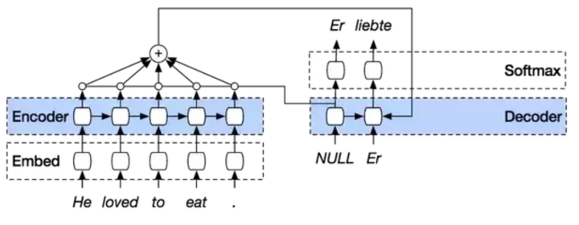
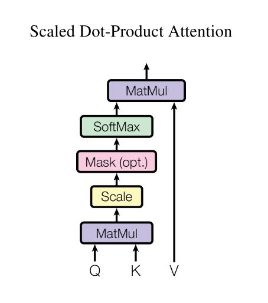
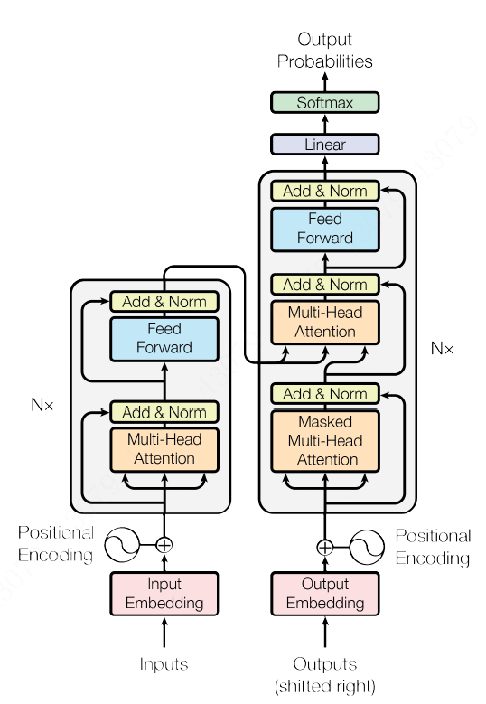
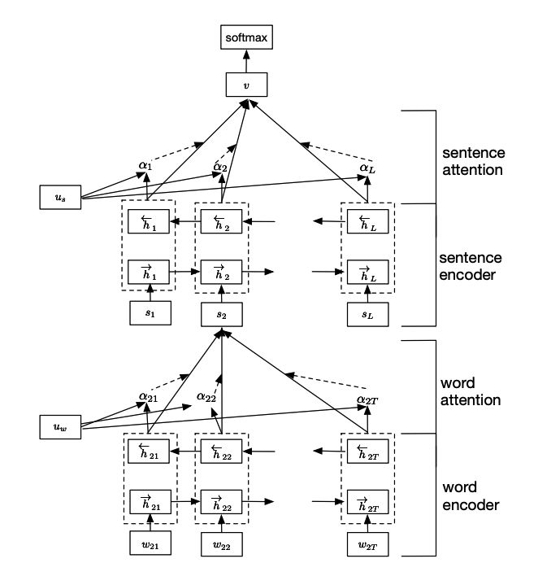

## 1. 基本的Attention原理

原本在Encoder-Decoder中，并没有告诉模型，需不需要特别注意什么，采取基本一视同仁的态度；

但在实际中，Encoder不同部分会影响后者的不同部分的程度是不一样的；

如在人的视觉中，会率先扫看全局，然后对需要注意的看的更多一些；

在翻译的时候也一样，在一个语言的句子A转换成另一个语言的句子B时，A中每个词对B中每个词的影响应该是不一样；

故而有注意力机制；在进行Decoder的时候，告诉此时Decoderd的某输出，哪些部分更重要。

### 1.1 Attention基本结构

### 1.2 Attention模型基本结构

普通的seq2seq模型：

引入注意力后：

### 1.3 Self-Attention基本结构

> 《Attention is all you need》中的Transformer模型几乎把Self-Attention应用到了极致。简单理解Self-Attention，即为Attention基础概念中的**Query，Key和Value均来自于相同的对象**，例如可以为同一个句子，句子中每个词语都和整个句子的中的词语进行对齐匹配，得到权重后再合整个句子的词向量进行加权求和，结果为融入**整个句子注意力信息的词向量**。下图为Transformer模型中使用的Self-Attention模块：
>
> 
>
> 整个计算公式为：
> $$
> \text { Attention }(Q, K, V)=\operatorname{softmax}\left(\frac{Q K^{T}}{\sqrt{d_{k}}}\right) V
> $$
>
> ---参考[8]

### 1.4 Transformer模型

## 2. HAN的原理（Hierarchical Attention Networks

> Hierarchical Attention也可以用来解决长文本注意力不集中的问题，与Local Attention不同的是，Local Attention强行限制了注意力机制的范围，忽略剩余位置。而Hierarchical Attention则使用分层的思想，在所有的状态上都利用了注意力机制，如下图：
>
> 
>
> 在篇章级文本分类中，文本由多个句子组成，句子由多个词语组成。在这样的思路中，首先分别在各个句子中使用注意力机制，提取出每个句子的关键信息，进而对每个句子的关键信息使用注意力机制，提取出文本的关键信息，最终利用文本的关键信息进行篇章及文本分类，公式如下：
> $$
> \begin{array}{r}{h_{i}^{(t)}=B i G R U\left(v_{i}^{(t)}\right)} \\ {v_{i}=\sum_{t} \operatorname{softmax}\left(u_{w}^{T} h_{i}^{(t)}\right) \cdot h_{i}^{(t)}} \\ {h_{i}=B i G R U\left(v_{i}\right)} \\ {c=\sum_{i} \operatorname{softmax}\left(u_{s}^{T} h_{i}\right) \cdot h_{i}}\end{array}
> $$
> ---参考[8]

模型说明

> 整个网络结构包括四个部分：
>
> 　　1）词序列编码器
>
> 　　2）基于词级的注意力层
>
> 　　3）句子编码器
>
> 　　4）基于句子级的注意力层
>
> 　　整个网络结构由双向GRU网络和注意力机制组合而成，具体的网络结构公式如下：
>
> 　　1）词序列编码器
>
> 　　　　给定一个句子中的单词 witwit ，其中 ii 表示第 ii 个句子，tt 表示第 tt 个词。通过一个词嵌入矩阵 WeWe 将单词转换成向量表示，具体如下所示：
>
> 　　　　　　xit=We;witxit=We;wit 
>
> 　　　　接下来看看利用双向GRU实现的整个编码流程：
> $$
> \begin{aligned}
> x_{i t} &=W_{e} w_{i t}, t \in[1, T] \\ 
> \vec{h}_{i t} &=\overrightarrow{\operatorname{GRU}}\left(x_{i t}\right), t \in[1, T] \\ 
> \overleftarrow h_{i t} & =\overleftarrow {\operatorname{GRU}}\left(x_{i t}\right), t \in[T, 1]
> \end{aligned}
> $$
> 
>
> 　　　　最终的 $h_{i t}=\left[\rightarrow h_{i t}, \leftarrow h_{i t}\right]$。
>
> 　　2）词级的注意力层
>
> 　　　　注意力层的具体流程如下：
> $$
> \begin{aligned} u_{i t} &=\tanh \left(W_{w} h_{i t}+b_{w}\right) \\ \alpha_{i t} &=\frac{\exp \left(u_{i t}^{\top} u_{w}\right)}{\sum_{t} \exp \left(u_{i t}^{\top} u_{w}\right)} \\ s_{i} &=\sum_{t} \alpha_{i t} h_{i t} \end{aligned}
> $$
> 
>
> 　　　　上面式子中，uituit 是 hithit 的隐层表示，aitait 是经 softmaxsoftmax 函数处理后的归一化权重系数，uwuw 是一个随机初始化的向量，之后会作为模型的参数一起被训练，sisi 就是我们得到的第 ii 个句子的向量表示。
>
>  　　3）句子编码器
>
> 　　　　也是基于双向GRU实现编码的，其流程如下，
> $$
> \begin{array}{l}{\vec{h}_{i}=\overrightarrow{\operatorname{GRU}}\left(s_{i}\right), i \in[1, L]} \\ {\overleftarrow h_{i}=\overleftarrow {\operatorname{GRU}}\left(s_{i}\right), t \in[L, 1]}\end{array}
> $$
> 
>
> 　　　　公式和词编码类似，最后的 hihi 也是通过拼接得到的
>
> 　　4）句子级注意力层
>
> 　　　　注意力层的流程如下，和词级的一致
> $$
> \begin{aligned} u_{i} &=\tanh \left(W_{s} h_{i}+b_{s}\right) \\ \alpha_{i} &=\frac{\exp \left(u_{i}^{\top} u_{s}\right)}{\sum_{i} \exp \left(u_{i}^{\top} u_{s}\right)} \\ v &=\sum_{i} \alpha_{i} h_{i} \end{aligned}
> $$
> 　　　　最后得到的向量 vv 就是文档的向量表示，这是文档的高层表示。接下来就可以用可以用这个向量表示作为文档的特征。
>
> **3、分类**
>
> 　　直接用 softmaxsoftmax 函数进行多分类即可
> $$
> p=\operatorname{softmax}\left(W_{c} v+b_{c}\right)
> $$
> 　　损失函数如下：
> $$
> L=-\sum_{d} \log p_{d j}
> $$
> 

1-2参考

> [1] [深度学习中的注意力模型（2017版）](https://zhuanlan.zhihu.com/p/37601161)
>
> [2] [nlp中的Attention注意力机制+Transformer详解](https://zhuanlan.zhihu.com/p/53682800)
>
> [3] [自然语言处理中注意力机制综述](https://mp.weixin.qq.com/s/6Qpf3amjMywet0eHKfBBlA?scene=25#wechat_redirect)
>
> [4] [深度学习中的注意力机制](https://blog.csdn.net/songbinxu/article/details/80739447)
>
> [5] [自然语言处理中的自注意力机制（Self-attention Mechanism）](https://www.cnblogs.com/robert-dlut/p/8638283.html)
>
> [6] [细讲 | Attention Is All You Need](https://mp.weixin.qq.com/s/RLxWevVWHXgX-UcoxDS70w)---主要翻译了参考[10]
>
> [7] [自然语言处理中的注意力机制是怎么回事？](https://zhuanlan.zhihu.com/p/26874632)
>
> [8] [综述：注意力机制在自然语言处理中的应用](https://zhuanlan.zhihu.com/p/54057012)
>
> [9] [真正的完全图解Seq2Seq Attention模型](https://zhuanlan.zhihu.com/p/40920384)
>
> [10] [The Illustrated Transformer](https://jalammar.github.io/illustrated-transformer/)---较为详细的说明的self-attention是怎么计算的，english
>
> [11] [Transformer原理和实现 从入门到精通](https://state-of-art.top/2019/01/17/Transformer原理和实现-从入门到精通/)---结合代码叙述了怎么回事，未细看

## 3. 利用Attention模型进行文本分类。

Code:

[1] [Seq2Seq(Attention)-Tensor.py](Seq2Seq(Attention)-Tensor.py)

[2] [Bi-LSTM(Attention)-Tensor.py](Bi-LSTM(Attention)-Tensor.py)

参考：

> [1] [注意力模型的一个实例代码的实现与分析](https://www.jianshu.com/p/c6b4c7810ee6)
>
> [2] [The Annotated Transformer](http://nlp.seas.harvard.edu/2018/04/03/attention.html)---很详细的transformer复习过程，哈佛nlp小组的，pytorch 0.3

