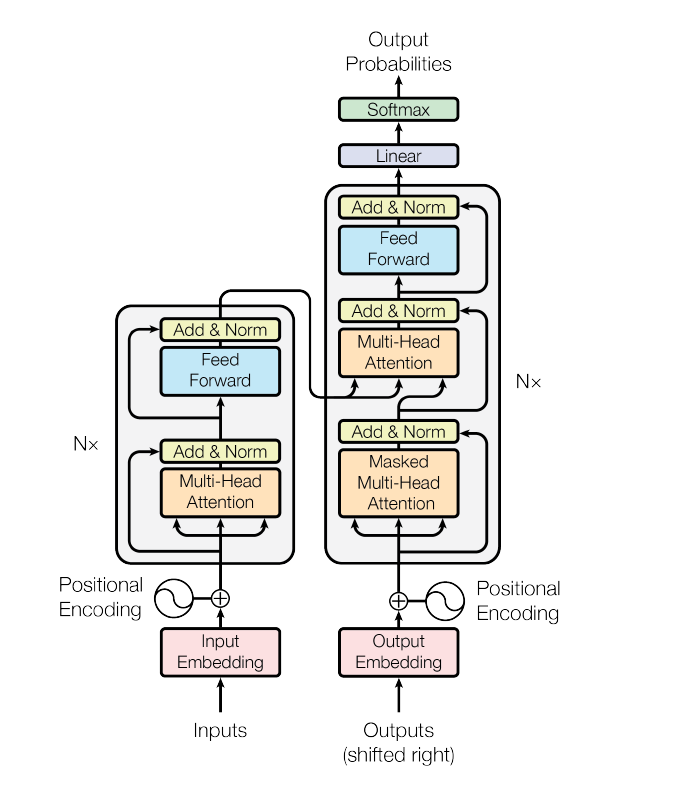
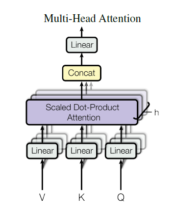
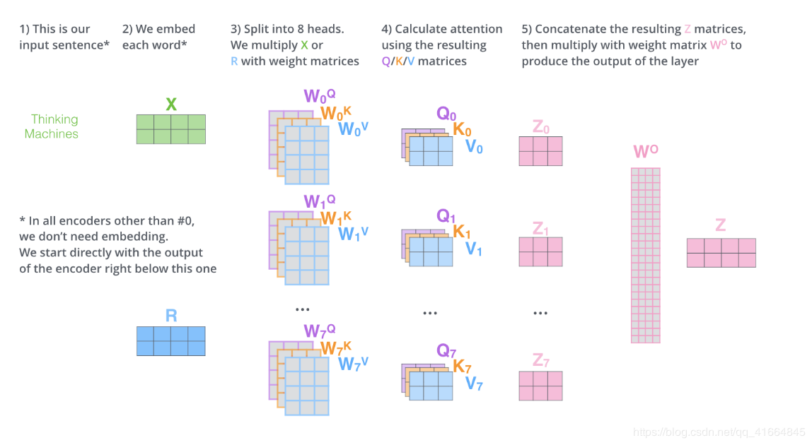
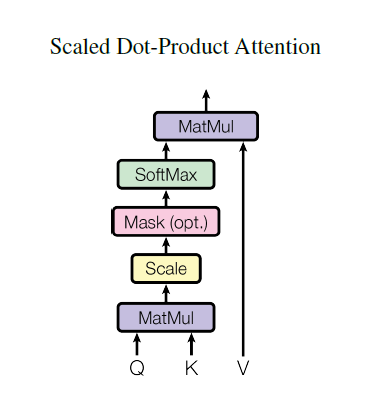
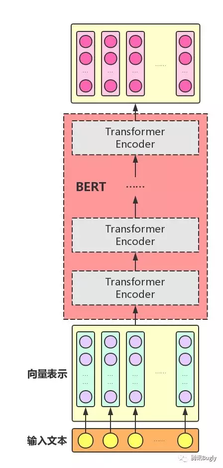
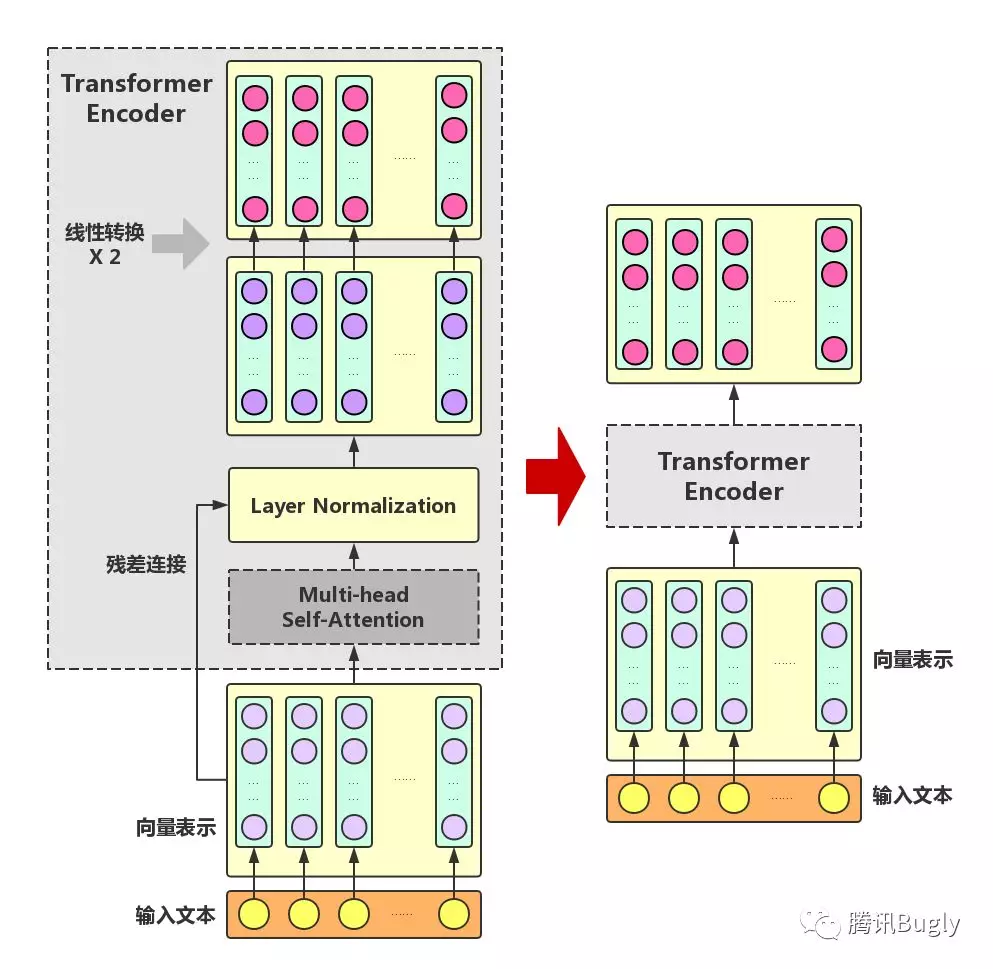
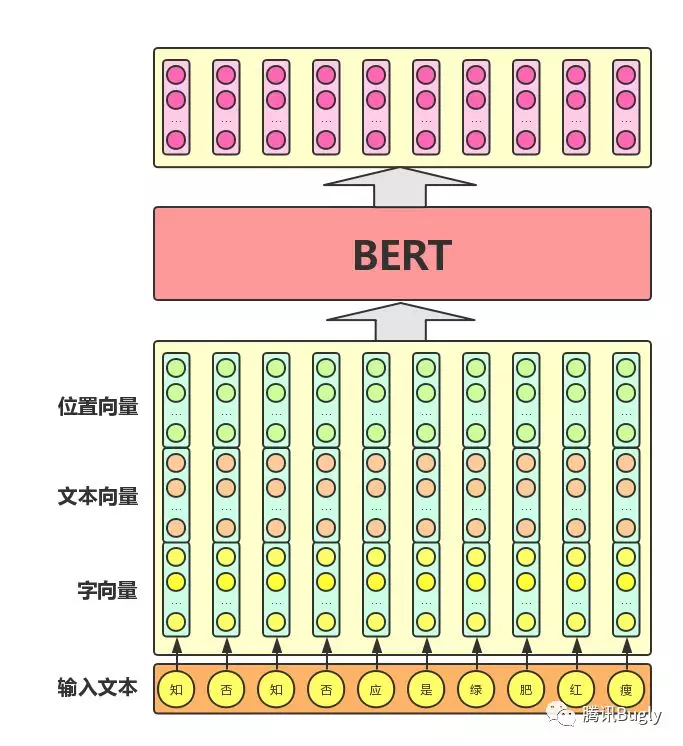
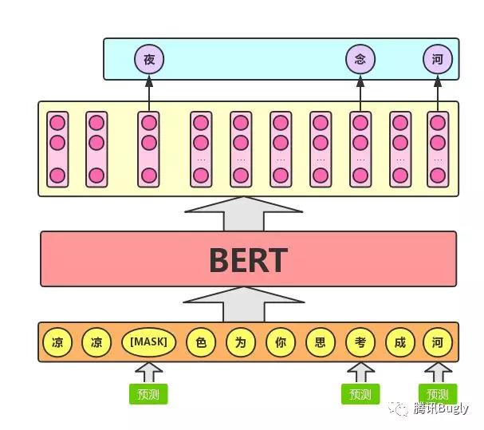
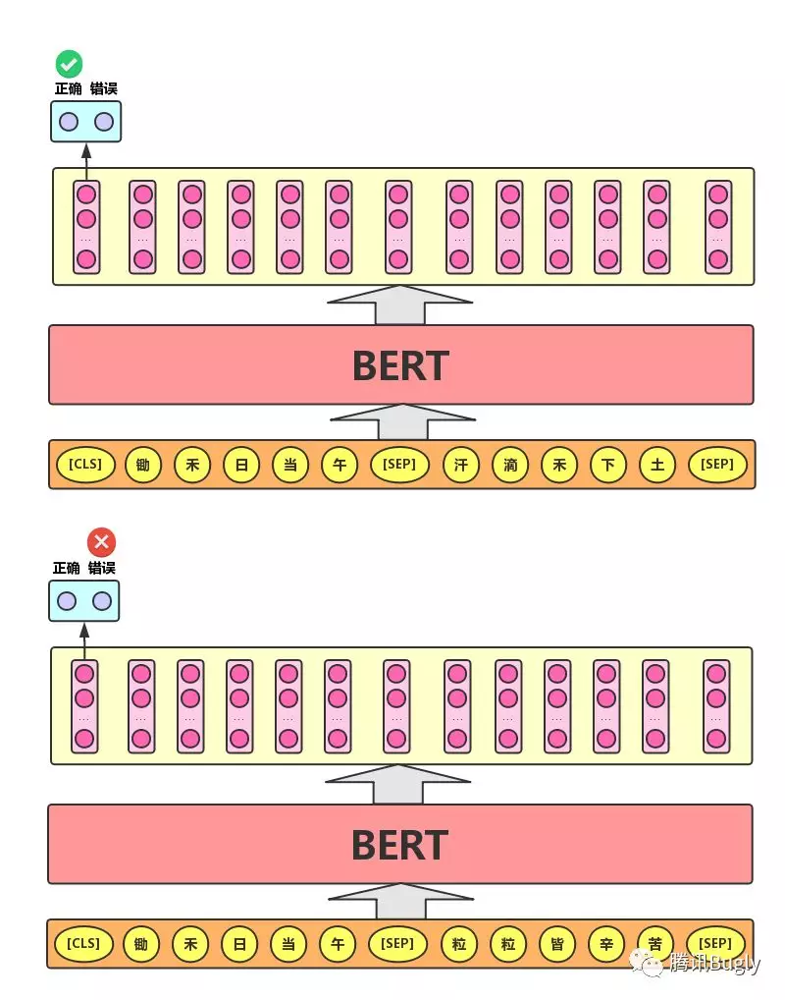

## 1. Transformer的原理

> 哈哈，没想到我竟然超前学习了，这里的内容会和`task-06`有部分重叠，但可能重叠的不多，毕竟那会没多相关的也没写多少；
>
> （想说的是，这一节内容与`task-06`有部分重叠）

### 1.1 模型结构

> 在论文中，两边的N 都是6层，每层的结构如图所示

### 1.2 关于`Multi-Head Attention`

> 关于里面V、K、Q，是输入x通过不同的线性变换得到的

或是这张图

> 权重$W^o$是开始随机生成的

### 1.3 关于`Multi-Head Attention`中的一次`self-Attention`

计算示例：

部分细节的补充：

> 
>
> embedding在进入到Attention之前，有3个分叉，那表示说从1个向量，变成了3个向量Q,K,V，它是通过定义一个$W^Q$矩阵（这个矩阵随机初始化，通过前向反馈网络训练得到），将embedding和$W^Q$矩阵做乘法，得到查询向量q，假设输入embedding是512维，在上图中我们用4个小方格表示，输出的查询向量是64维，上图中用3个小方格以示不同。然后类似地，定义$W^K$和$W^V$矩阵，将embedding和$W^K$做矩阵乘法，得到键向量k；将embeding和$W^V$做矩阵乘法，得到值向量v。对每一个embedding做同样的操作，那么每个输入就得到了3个向量，查询向量，键向量和值向量。需要注意的是，查询向量和键向量要有相同的维度，值向量的维度可以相同，也可以不同，但一般也是相同的。
>
> 至于将获得的Q,K,V矩阵具体操作，总的来说，就是以下这幅图。
>
> 
>
> ---参考[7]

### 1.4 关于`Feed Forword`

### 1.5 关于`Add&Norm`

### 1.5 关于模型输入

> 其中`positional encoding`是通过统一规则生成的
>
> 参考[2]说的是一半通过正弦函数，一半通过余弦函数生成
>
> 而原文参考[3] 说的是`奇偶位置差异`

### 1.6 关于训练

Encoder:

Decoder:

参考

> [1] [2. Attention Is All You Need（Transformer）算法原理解析](https://www.cnblogs.com/huangyc/p/9813907.html)---总结很到位
>
> [2] [图解Transformer](https://blog.csdn.net/qq_41664845/article/details/84969266)---先看这个很详细，一步一步来的
>
> [3] Ashish Vaswani, Noam Shazeer, Niki Parmar, Jakob Uszkoreit, Llion Jones, Aidan N. Gomez, Lukasz Kaiser, Illia Polosukhin, [Attention Is All You Need](https://arxiv.org/abs/1706.03762), 2017---原论文
>
> [4] [The Illustrated Transformer](https://jalammar.github.io/illustrated-transformer/)---参考[2]原文
>
> [5] [Transformer模型笔记](https://zhuanlan.zhihu.com/p/39034683)---含有pytorch代码
>
> [6] [Transformer原理和实现 从入门到精通](https://state-of-art.top/2019/01/17/Transformer%E5%8E%9F%E7%90%86%E5%92%8C%E5%AE%9E%E7%8E%B0-%E4%BB%8E%E5%85%A5%E9%97%A8%E5%88%B0%E7%B2%BE%E9%80%9A/)---逐步代码解读
>
> [7] [浅谈Transformer 及Attention网络](https://blog.csdn.net/rosefun96/article/details/84930540)

## 2. BERT的原理

### 2.1 BERT简况

BERT模型的全称是：Bidirectional Encoder **Representations** from Transformer。

BERT的输入与输出[5]：

输入：文本中各个字/词的原始向量（可以是随机初始化、也可以使用word2vec等方式获得）；

输出：文本中各个字/或词融合了全文语义信息后的向量表示。

BERT模型的目标[5]：利用大规模无标注语料训练、获得文本的包含丰富语义信息的Representation，即：文本的语义表示，然后将文本的语义表示在特定NLP任务中作微调，最终应用于该NLP任务。

优缺点[3]：

* 优点：

  效果好；

  获得真正意义上的bidrectional context;

* 缺点：

  [MASK]标记在实际预测中不会出现，训练时用过多[MASK]影响模型表现

  每个batch只有15%的token被预测，所以BERT收敛得比left-to-right模型要慢（它们会预测每个token）

  

### 2.2 BERT 结构

### 2.3 关于Transformer

> 原Transformer 由两部分组成，Enocder和Decoder;
>
> 在BERT中只使用了Encoder，（推测：因为不需要需要这个功能）

### 2.4 关于输入

进入到BERT的向量由三个向量相加而成，更准确点应该是三个向量拼接而成

### 2.5 关于预训练任务

#### 2.5.1 Mask language Model

> 就像英语的选词填空

> 实现了真正bidirectional的效果

> 随机遮掩每个序列中的15%,用于预测，在这15%中：
>
> ​	10%保持原词汇不变；
>
> ​	10%替换为其他词；
>
> ​	80%替换为`[MASK]`

#### 2.5.2 Next sentence prediction

参考

> [1] [**BERT介绍**](https://blog.csdn.net/triplemeng/article/details/83053419)
>
> [2] [如何评价 BERT 模型？](https://www.zhihu.com/question/298203515)---关于`里程碑`的讨论
>
> [3] [【NLP】Google BERT详解](https://zhuanlan.zhihu.com/p/46652512)
>
> [4] [Github项目推荐 | awesome-bert：BERT相关资源大列表](http://mp.weixin.qq.com/s?src=11&timestamp=1566377229&ver=1803&signature=xFYiLldsQPhW943eIr-zlMWe82Tn8DA1o47GJbbRFR-x4lc-3tZseVke9eX6AcVYzpZ0QrKoSLn3tYYnfA-Kz9cuPSTQ6P1P2rg2CxeDCRzGp**X0j1qbT9QzeH*Svy2&new=1)---目前现有关于BERT的成果
>
> [5] [图解BERT模型：从零开始构建BERT](https://mp.weixin.qq.com/s/HOt11jG0DhhVuFWYhKNXtg)---五星好评
>
> [6] [Bert时代的创新（应用篇）：Bert在NLP各领域的应用进展](https://zhuanlan.zhihu.com/p/68446772)
>
> [7] jacobdevlin,mingweichang,kentonl,kristout, BERT: Pre-training of Deep Bidirectional Transformers for Language Understanding, 2018
>
> [8] [图解BERT（NLP中的迁移学习）](https://www.cnblogs.com/d0main/p/10165671.html)
>
> [9] [BERT模型](https://blog.csdn.net/luoxiaolin_love/article/details/84618247)

## 3. 利用预训练的BERT模型将句子转换为句向量，进行文本分类

[Code](BERT)

> 运行是在GTX1060上的机子上运行的，所以`run.sh`中`train_batch_size=16 `由参数16调整至参数8

参考

> [1] [jiangxinyang227/textClassifier](https://github.com/jiangxinyang227/textClassifier/tree/master/BERT)
>
> [2] [文本分类实战（十）—— BERT 预训练模型](https://www.cnblogs.com/jiangxinyang/p/10241243.html)
>

